# Week 1: Physical AI Foundations

import LearningObjectives from '@site/src/components/LearningObjectives';
import WeekSummary from '@site/src/components/WeekSummary';

## Introduction

Welcome to the first week of Physical AI & Humanoid Robotics! This week lays the conceptual foundation for understanding how artificial intelligence moves beyond purely digital environments into the physical world. We'll explore what makes physical AI fundamentally different from traditional AI, and why embodied intelligence requires new approaches to perception, decision-making, and action.

<LearningObjectives>

### Learning Objectives

By the end of this week, you will be able to:

- Define **Physical AI** and explain how it differs from traditional digital AI systems
- Understand the concept of **embodied intelligence** and why physical embodiment matters
- Describe the **sensor-actuator loop** as the core control cycle in robotic systems
- Identify key challenges unique to physical AI (real-time constraints, uncertainty, safety)
- Recognize the importance of the **sim-to-real gap** in robotics development

</LearningObjectives>

## Core Concepts

### 1. What is Physical AI?

**Physical AI** refers to artificial intelligence systems that interact directly with the physical world through sensors and actuators. Unlike traditional AI that operates purely in digital environments (e.g., playing chess, analyzing text, generating images), Physical AI must:

- **Perceive** the real world through sensors (cameras, LiDAR, force sensors, IMUs)
- **Decide** what actions to take based on incomplete and noisy information
- **Act** in the physical world through actuators (motors, grippers, wheels)
- **Adapt** to unpredictable real-world conditions in real-time

Examples of Physical AI systems include:
- Autonomous vehicles navigating city streets
- Warehouse robots picking and placing packages
- Humanoid robots performing household tasks
- Surgical robots assisting in delicate procedures
- Agricultural drones monitoring crop health

### 2. Embodied Intelligence

**Embodied intelligence** is the theory that intelligence is fundamentally shaped by the physical body and its interactions with the environment. Key principles:

**Body Morphology Matters**: The physical structure of a robot (bipedal vs. quadrupedal, gripper design, sensor placement) directly influences what it can perceive and do. A humanoid robot's two-legged structure enables navigating human environments but requires complex balance control.

**Environment Interaction**: Intelligence emerges from the continuous interaction between body, brain, and environment—not from computation alone. A robot learns to grasp objects not just by computing optimal trajectories, but by physically trying and receiving tactile feedback.

**Sensorimotor Coupling**: Perception and action are tightly coupled. You can't understand what a robot "sees" without understanding how it moves, and vice versa. For example, a robot must move its camera to get better views of an object.

**Real-Time Constraints**: Physical systems operate on strict real-time deadlines. A humanoid robot must compute balance corrections within milliseconds, or it will fall.

### 3. The Sensor-Actuator Loop

The fundamental control cycle in robotics is the **sensor-actuator loop**:

```
┌─────────────────────────────────────────────┐
│                                             │
│  SENSE → PROCESS → DECIDE → ACT → OBSERVE  │
│    ↑                                   │    │
│    └───────────────────────────────────┘    │
└─────────────────────────────────────────────┘
```

**1. SENSE**: Collect data from sensors (cameras, LiDAR, IMU, joint encoders, force/torque sensors)

**2. PROCESS**: Filter, transform, and fuse sensor data into a coherent world model

**3. DECIDE**: Plan what action to take based on current state and goals

**4. ACT**: Send commands to actuators (motor controllers, grippers)

**5. OBSERVE**: Measure the effect of actions and update world model

This loop repeats continuously at frequencies ranging from 10 Hz (low-level vision) to 1000 Hz (motor control). Breaking this loop or introducing delays can cause instability or failure.

### 4. Physical AI vs. Traditional AI

| Aspect | Traditional AI | Physical AI |
|--------|---------------|-------------|
| **Environment** | Digital, deterministic | Physical, stochastic |
| **Feedback** | Delayed, complete | Real-time, partial |
| **Consequences** | Virtual (retry possible) | Physical (irreversible) |
| **State Space** | Discrete, observable | Continuous, partially observable |
| **Latency** | Flexible | Hard real-time constraints |
| **Safety** | Low stakes | High stakes (damage, injury) |
| **Testing** | Fast, repeatable | Slow, expensive, risky |

**Key Insight**: Physical AI must deal with **uncertainty** at every level:
- Sensor noise and occlusions
- Unpredictable environment changes
- Actuator imprecision and wear
- Model mismatch (sim-to-real gap)

## Practical Explanation

### Why Embodied Intelligence Matters: The Roomba Example

Consider a robotic vacuum cleaner (Roomba). Its intelligence doesn't come from having a perfect map of your home or optimal path planning algorithms. Instead:

1. **Simple Sensors**: It uses basic bump sensors, cliff detectors, and dirt sensors
2. **Reactive Behaviors**: It follows simple rules: "If bump → turn random angle → move forward"
3. **Emergent Coverage**: Over time, this random-walk behavior covers the entire floor
4. **Environmental Exploitation**: It uses walls as guides rather than obstacles to avoid

This is **embodied intelligence**: The robot's circular body shape, sensor placement, and simple reactive behaviors create effective cleaning without complex world models or planning.

### The Sim-to-Real Gap

One of the biggest challenges in Physical AI is the **sim-to-real gap**: the difference between simulated environments (where we train robots) and the real world (where they must operate).

**Example**: A robot trained in simulation to pick up blocks might fail in the real world because:
- Simulated physics don't perfectly match reality (friction, contact dynamics)
- Real cameras have noise, motion blur, and lighting variations
- Real motors have delays, backlash, and wear

**Solutions** to bridge the sim-to-real gap:
- **Domain Randomization**: Train with wide variations in simulation (lighting, textures, physics parameters)
- **Sim-to-Real Transfer Learning**: Use simulation for initial training, then fine-tune in the real world
- **Digital Twins**: Create high-fidelity simulations calibrated to match specific real robots
- **Hardware-in-the-Loop**: Test control algorithms on real motors before deploying on full robot

## Visual Aids

### Sensor-Actuator Loop Diagram


### Physical AI System Architecture

```mermaid
graph TD
    A[Sensors] --> B[Sensor Fusion]
    B --> C[State Estimation]
    C --> D[Planning]
    D --> E[Control]
    E --> F[Actuators]
    F --> G[Robot Body]
    G --> A

    H[User Commands] --> D
    C --> I[Visualization]
    C --> J[Logging]

    style A fill:#141824,stroke:#00d4ff,stroke-width:2px
    style G fill:#141824,stroke:#00d4ff,stroke-width:2px
    style D fill:#141824,stroke:#ff6b6b,stroke-width:2px
```



## Code Example: Simple Sensor-Actuator Loop

Here's a minimal example of a sensor-actuator loop in Python pseudocode:

```python
import time

class SimpleRobot:
    def __init__(self):
        self.position = 0.0
        self.velocity = 0.0
        self.target = 10.0

    def sense(self):
        """Read sensor data (current position)"""
        # In real robot: read from encoders, cameras, etc.
        return self.position

    def decide(self, current_position):
        """Decide what action to take"""
        error = self.target - current_position

        # Simple proportional controller
        desired_velocity = 0.5 * error

        return desired_velocity

    def act(self, desired_velocity):
        """Send commands to actuators"""
        self.velocity = desired_velocity

        # In real robot: send motor commands
        # For simulation: update position
        self.position += self.velocity * 0.1  # dt = 0.1s

    def run(self, duration=5.0):
        """Main control loop"""
        start_time = time.time()

        while time.time() - start_time < duration:
            # The sensor-actuator loop
            current_pos = self.sense()          # SENSE
            desired_vel = self.decide(current_pos)  # DECIDE
            self.act(desired_vel)               # ACT

            print(f"Position: {current_pos:.2f}, Target: {self.target:.2f}")

            # Real-time constraint: run at 10 Hz
            time.sleep(0.1)

        print(f"Final position: {self.position:.2f}")

# Run the robot
robot = SimpleRobot()
robot.run()
```

**Key Observations**:
- The loop runs at fixed frequency (10 Hz)
- Each iteration: sense → decide → act
- Simple proportional control: velocity proportional to error
- In real systems, this would interface with hardware drivers

## Real-World Applications

### Tesla Optimus Humanoid Robot

Tesla's Optimus robot demonstrates Physical AI principles in action:

- **Embodied Design**: Human-like form factor to navigate human environments
- **Sensor Suite**: Cameras (vision), IMUs (balance), joint encoders (proprioception), force sensors (touch)
- **Real-Time Control**: 200+ Hz control loops for balance and manipulation
- **Sim-to-Real**: Trained in simulation (Isaac Gym), deployed to real hardware
- **End-to-End Learning**: Neural networks map sensor inputs directly to motor commands

### Challenges Faced:
1. **Balance**: Bipedal walking requires constant micro-adjustments
2. **Manipulation**: Grasping diverse objects with varying properties
3. **Perception**: Robust vision in varied lighting and occlusion
4. **Safety**: Must never harm humans or damage environment

<WeekSummary nextWeek={{title: "Week 2: Embodied Intelligence Deep Dive", href: "/module-1-physical-ai/week-2/"}}>

## Summary

This week introduced the foundational concepts of Physical AI:

- **Physical AI** systems interact with the real world through sensors and actuators, facing challenges like uncertainty, real-time constraints, and safety requirements that don't exist in purely digital AI.

- **Embodied intelligence** emphasizes that intelligence emerges from the interaction between body, brain, and environment—not just computation. The physical form of a robot directly shapes what it can perceive and do.

- The **sensor-actuator loop** (sense → process → decide → act → observe) is the fundamental control cycle in robotics, running continuously at high frequencies to maintain stability and responsiveness.

- The **sim-to-real gap** remains a major challenge, requiring techniques like domain randomization and transfer learning to bridge the difference between simulated training environments and real-world deployment.

**Key Takeaway**: Moving AI from digital to physical domains requires rethinking fundamental assumptions about control, perception, and learning. The physical world is messy, unpredictable, and unforgiving—but that's what makes Physical AI both challenging and exciting.

</WeekSummary>
