# Week 2: Embodied Intelligence Deep Dive

import LearningObjectives from '@site/src/components/LearningObjectives';
import WeekSummary from '@site/src/components/WeekSummary';

## Introduction

Building on Week 1's foundations, this week dives deeper into embodied intelligence—the principle that intelligence emerges from the interaction between body, brain, and environment. We'll explore how physical morphology shapes cognition, how perception and action are inseparably coupled, and why sensorimotor learning is fundamental to robotics.

<LearningObjectives>

### Learning Objectives

By the end of this week, you will be able to:

- Explain how **morphological computation** offloads complexity from controllers to robot body design
- Understand **perception-action coupling** and why it's essential for robust robot behavior
- Describe **sensorimotor learning** approaches for acquiring manipulation skills
- Analyze how **environmental scaffolding** enables simpler control strategies
- Recognize the role of **proprioception** in robot self-awareness and control

</LearningObjectives>

## Core Concepts

### 1. Morphological Computation

**Morphological computation** is the idea that intelligent behavior can emerge from the physical structure of the body itself, reducing computational burden on the controller.

**Key Principle**: The right body design can solve problems passively, without explicit control algorithms.

**Examples**:

- **Passive Walkers**: Bipedal robots that walk downhill purely from gravity and leg geometry, with zero actuation or control
- **Compliant Grippers**: Soft, flexible fingers that conform to object shapes without complex grasp planning
- **Hexapod Stability**: Six-legged robots that maintain stability naturally due to tripod gait geometry

**Design Implication**: Engineers should co-design morphology and control together, not sequentially. The body is not just a platform for intelligence—it IS part of the intelligence.

### 2. Perception-Action Coupling

**Perception-action coupling** means perception and action are not separate modules but form a tightly integrated loop.

**Why It Matters**:
- You cannot plan actions without knowing what you can perceive
- You cannot interpret sensory data without considering how you're moving
- Optimal behavior requires closed-loop feedback between sensing and acting

**Example: Active Vision**
A robot doesn't just passively observe a scene. It actively moves its camera to:
- Reduce occlusions (move head to see behind objects)
- Improve lighting (adjust viewing angle)
- Gain depth information (parallax from motion)
- Focus attention (saccadic eye movements)

**Comparison**:

| Traditional AI Approach | Embodied Approach |
|-------------------------|-------------------|
| Perception → Planning → Action (sequential) | Perception ↔ Action (continuous loop) |
| Build complete world model first | Incrementally refine model through action |
| Assume static, observable environment | Assume dynamic, partially observable world |
| Offline planning | Online reactive control |

### 3. Sensorimotor Learning

**Sensorimotor learning** is learning control policies by directly mapping sensor inputs to motor outputs through experience.

**Approaches**:

**1. Reinforcement Learning (RL)**:
- Agent learns through trial and error
- Reward signal guides behavior improvement
- Example: Robot learns to grasp by trying different grips and receiving success/failure feedback

**2. Imitation Learning**:
- Robot learns by observing human demonstrations
- Captures expert behavior patterns
- Example: Learning to pour liquid by watching human demonstrations

**3. Self-Supervised Learning**:
- Robot generates its own training data through interaction
- No human labeling required
- Example: Robot pushes objects randomly to learn object dynamics

### 4. Environmental Scaffolding

**Environmental scaffolding** means exploiting environmental structure to simplify control.

**Key Insight**: The environment is not just a passive obstacle space—it's an active partner in solving control problems.

**Examples**:

**Wall Following**: Rather than maintaining a straight path through complex localization, a robot simply keeps a fixed distance from a wall using a single side-facing sensor.

**Contact-Rich Manipulation**: When inserting a peg into a hole, use the hole's edges to guide the peg rather than trying to achieve perfect position accuracy.

**Passive Stabilization**: A quadruped robot uses ground reaction forces to passively stabilize its body without explicit balance controllers.

### 5. Proprioception and Body Awareness

**Proprioception** is the sense of body position and movement—the robot's self-awareness.

**Key Sensors**:
- Joint encoders (angle, velocity)
- Inertial Measurement Units (IMU) - acceleration, angular velocity
- Force/torque sensors at joints or contact surfaces
- Tactile sensors on grippers and feet

**Why It's Critical**:
- Humanoid balance requires constant IMU feedback to detect tilt
- Manipulation requires force feedback to avoid crushing objects
- Locomotion requires joint position feedback for coordinated movement
- Collision detection requires unexpected force/torque measurements

## Practical Explanation

### Case Study: Boston Dynamics Spot Robot

Boston Dynamics' Spot quadruped robot exemplifies embodied intelligence principles:

**1. Morphological Design**:
- Four legs provide static and dynamic stability
- Compliant legs absorb shocks passively
- Leg length and geometry enable traversing stairs and obstacles

**2. Perception-Action Coupling**:
- Stereo cameras actively scan terrain ahead
- Gait adjusts in real-time based on perceived ground texture
- Proprioceptive feedback continuously adjusts joint torques

**3. Environmental Exploitation**:
- Uses walls and railings for support when climbing stairs
- Exploits momentum to jump over gaps
- Uses contact forces to recover from pushes (doesn't fight, yields and recovers)

**4. Learning and Adaptation**:
- Learns terrain-specific gaits through simulation
- Adapts to slippery surfaces by modulating foot contact forces
- Recovers from disturbances using learned recovery behaviors

### Hands-On Example: Implementing Perception-Action Coupling

Here's a simple example of active vision—a robot that moves its camera to keep a target centered:

```python
import numpy as np

class ActiveVisionRobot:
    def __init__(self):
        self.camera_angle = 0.0  # Current camera pan angle
        self.target_position = None  # Target in camera frame

    def perceive(self, image):
        """Detect target position in camera image"""
        # Simplified: returns x-offset from image center (-1 to 1)
        # In real system: use computer vision (OpenCV, deep learning)
        target_x = self.detect_target(image)
        return target_x

    def detect_target(self, image):
        """Placeholder for vision processing"""
        # Real implementation: object detection, tracking
        return np.random.uniform(-0.5, 0.5)

    def decide_camera_motion(self, target_x_offset):
        """Decide how to move camera to center target"""
        # Proportional controller: turn toward target
        gain = 0.3
        desired_angular_velocity = -gain * target_x_offset
        return desired_angular_velocity

    def act(self, angular_velocity):
        """Move camera"""
        dt = 0.1  # 10 Hz control
        self.camera_angle += angular_velocity * dt

        # Simulate motor limits
        self.camera_angle = np.clip(self.camera_angle, -90, 90)

    def run_active_vision(self, image_stream, duration=5.0):
        """Main perception-action loop"""
        import time
        start = time.time()

        while time.time() - start < duration:
            # PERCEIVE: Where is target relative to camera center?
            image = next(image_stream)
            target_offset = self.perceive(image)

            # DECIDE: How should camera move to center target?
            camera_velocity = self.decide_camera_motion(target_offset)

            # ACT: Move camera
            self.act(camera_velocity)

            print(f"Target offset: {target_offset:+.2f} | "
                  f"Camera velocity: {camera_velocity:+.2f} | "
                  f"Camera angle: {self.camera_angle:+.1f}°")

            time.sleep(0.1)

        print(f"Final camera angle: {self.camera_angle:.1f}°")

# Simulate image stream (in real system: camera feed)
def mock_image_stream():
    while True:
        yield np.zeros((480, 640, 3))  # Placeholder image

# Run active vision
robot = ActiveVisionRobot()
robot.run_active_vision(mock_image_stream(), duration=3.0)
```

**Key Observations**:
- Perception (target detection) directly drives action (camera motion)
- No separate "world model" or offline planning
- Closed-loop control: action affects future perception
- Simple but robust to noise and disturbances

## Visual Aids

### Morphological Computation Example

```mermaid
graph TD
    A[Control Problem] --> B{Solution Strategy}
    B -->|Traditional| C[Complex Controller]
    B -->|Morphological| D[Smart Body Design]

    C --> E[High computation, rigid behavior]
    D --> F[Low computation, adaptive behavior]

    style A fill:#141824,stroke:#00d4ff,stroke-width:2px
    style D fill:#141824,stroke:#4ade80,stroke-width:2px
    style F fill:#141824,stroke:#4ade80,stroke-width:2px
```



### Perception-Action Loop

```mermaid
graph LR
    A[Sensors] -->|Sensory Data| B[Perception]
    B -->|State Estimate| C[Action Selection]
    C -->|Motor Commands| D[Actuators]
    D -->|Change Environment| E[World State]
    E -->|Affects Sensors| A

    C -.->|Prediction| B
    B -.->|Attention| A

    style A fill:#141824,stroke:#00d4ff,stroke-width:2px
    style E fill:#141824,stroke:#00d4ff,stroke-width:2px
    style C fill:#141824,stroke:#ff6b6b,stroke-width:2px
```



### Sensorimotor Learning Framework

```mermaid
graph TD
    A[Random Exploration] --> B[Collect Experience]
    B --> C[Sensory Input, Motor Output, Outcome]
    C --> D[Update Internal Model]
    D --> E[Refine Policy]
    E --> F[Test New Behavior]
    F -->|Success| G[Reinforce Policy]
    F -->|Failure| A
    G --> E

    style A fill:#141824,stroke:#00d4ff,stroke-width:2px
    style G fill:#141824,stroke:#4ade80,stroke-width:2px
```



## Real-World Applications

### Soft Robotics and Morphological Computation

**Example: Festo BionicSoftHand**

This pneumatic gripper uses soft, compliant fingers that:
- Conform to object shapes without shape recognition or grasp planning
- Distribute forces evenly to avoid damage
- Require minimal sensors (just pressure feedback)
- Achieve robust grasps on irregular objects

**Embodied Intelligence Principle**: The soft morphology SOLVES the grasping problem mechanically, not computationally.

### Humanoid Robots and Sensorimotor Learning

**Example: Tesla Optimus Learning to Fold Shirts**

- **Imitation Learning**: Watches human demonstrations of folding
- **Proprioception**: Uses joint encoders and force sensors to replicate motion
- **Environmental Scaffolding**: Uses table surface to stabilize fabric
- **Perception-Action Coupling**: Adjusts grip force based on visual and tactile feedback

**Challenge**: Fabric is highly deformable (infinite degrees of freedom). Pure model-based planning is intractable. Embodied learning approach is essential.

<WeekSummary nextWeek={{title: "Week 3: ROS 2 Architecture Fundamentals", href: "/module-1-physical-ai/week-3/"}}>

## Summary

This week explored how embodied intelligence fundamentally shapes robotic systems:

- **Morphological computation** demonstrates that intelligent behavior can emerge from body design itself, offloading computational complexity to physical structure. The right morphology makes hard control problems easy.

- **Perception-action coupling** reveals that perception and action form an inseparable loop, not sequential stages. Robots perceive through action and act based on perception continuously.

- **Sensorimotor learning** approaches (reinforcement learning, imitation, self-supervision) enable robots to acquire skills through direct interaction rather than explicit programming.

- **Environmental scaffolding** shows that environments are active partners in control, not just obstacle spaces. Exploiting environmental structure simplifies control dramatically.

- **Proprioception** provides essential self-awareness for balance, manipulation, and coordination, enabling robots to sense their own body state.

**Key Takeaway**: Embodied intelligence shifts design philosophy from "build a smart brain" to "co-design brain, body, and environmental interaction." The body is not a passive vessel for intelligence—it IS part of the intelligence.

**Next Week**: We begin exploring ROS 2 (Robot Operating System 2), the middleware that enables building complex robotic systems by connecting sensors, actuators, and algorithms.

</WeekSummary>
