# Week 3: ROS 2 Architecture Fundamentals

import LearningObjectives from '@site/src/components/LearningObjectives';
import WeekSummary from '@site/src/components/WeekSummary';

## Introduction

ROS 2 (Robot Operating System 2) is the industry-standard middleware for robotics development. It provides tools, libraries, and conventions for building modular robot software. This week, we'll explore ROS 2's architecture, understand how nodes communicate, and learn to structure robotic applications.

<LearningObjectives>

### Learning Objectives

By the end of this week, you will be able to:

- Explain the **ROS 2 architecture** and how it differs from ROS 1
- Understand **DDS (Data Distribution Service)** as the communication layer
- Create and run **ROS 2 nodes** using Python (rclpy)
- Organize code into **ROS 2 packages** with proper structure
- Navigate the **ROS 2 filesystem** (workspaces, packages, nodes)

</LearningObjectives>

## Core Concepts

### 1. What is ROS 2?

**ROS 2** is NOT an operating system—it's a middleware framework that provides:

- **Communication infrastructure**: Nodes exchange data over topics, services, and actions
- **Hardware abstraction**: Uniform APIs for sensors and actuators
- **Package management**: Standardized way to organize and share code
- **Build system**: colcon for compiling C++ and Python packages
- **Tools**: Command-line utilities for debugging, visualization, and introspection

**Key Philosophy**: Modularity and reusability. Break complex robot systems into small, single-purpose nodes that communicate via well-defined interfaces.

### 2. ROS 2 vs. ROS 1

| Feature | ROS 1 | ROS 2 |
|---------|-------|-------|
| **Communication** | Custom TCPROS/UDPROS | DDS (standard protocol) |
| **Real-Time** | No | Yes (with DDS QoS) |
| **Multi-Robot** | Difficult | Native support |
| **Security** | None | DDS Security (encryption, authentication) |
| **Platforms** | Linux only | Linux, Windows, macOS, RTOS |
| **Lifecycle** | None | Managed node lifecycle |

**Why ROS 2?**
- Industrial applications require real-time guarantees
- Multi-robot systems are becoming common
- Security is critical for production deployment
- Cross-platform support expands use cases

### 3. DDS: The Communication Foundation

**Data Distribution Service (DDS)** is a proven middleware standard (OMG specification) that ROS 2 uses for communication.

**Key Features**:
- **Peer-to-peer**: No central master (unlike ROS 1's roscore)
- **Discovery**: Nodes automatically find each other on the network
- **QoS (Quality of Service)**: Reliable vs. best-effort, persistence, deadline policies
- **Real-time**: Bounded latency, priority-based delivery

**DDS Vendors** (ROS 2 supports multiple):
- Fast DDS (default)
- Cyclone DDS
- RTI Connext DDS

**How It Works**:
```
Publisher Node → DDS Layer → Network → DDS Layer → Subscriber Node
```

### 4. ROS 2 Nodes

A **node** is a single-purpose process that performs computation.

**Examples**:
- Camera driver node: publishes camera images
- Object detector node: subscribes to images, publishes bounding boxes
- Motion planner node: subscribes to goal pose, publishes trajectory
- Motor controller node: subscribes to velocity commands, controls hardware

**Node Design Principles**:
- **Single Responsibility**: Each node does one thing well
- **Loose Coupling**: Nodes communicate only through topics/services, not direct function calls
- **Reusability**: Generic nodes (e.g., `image_transport`) work with any robot

### 5. ROS 2 Packages

A **package** is a directory containing nodes, libraries, configuration files, and build instructions.

**Standard Package Structure**:
```
my_robot_package/
├── package.xml          # Metadata (name, version, dependencies)
├── setup.py             # Python package setup (for Python packages)
├── CMakeLists.txt       # Build instructions (for C++ packages)
├── my_robot_package/    # Python module directory
│   ├── __init__.py
│   ├── node1.py         # Node implementations
│   └── node2.py
├── launch/              # Launch files (start multiple nodes)
│   └── robot.launch.py
├── config/              # Configuration files (YAML)
│   └── params.yaml
└── resource/            # Resource marker files
```

## Practical Explanation

### Creating Your First ROS 2 Node

Here's a minimal ROS 2 node in Python:

```python
import rclpy
from rclpy.node import Node

class MinimalNode(Node):
    def __init__(self):
        super().__init__('minimal_node')
        self.get_logger().info('Minimal node started!')

        # Create a timer that calls timer_callback every 1 second
        self.timer = self.create_timer(1.0, self.timer_callback)
        self.counter = 0

    def timer_callback(self):
        self.counter += 1
        self.get_logger().info(f'Timer callback #{self.counter}')

def main(args=None):
    rclpy.init(args=args)
    node = MinimalNode()

    try:
        rclpy.spin(node)  # Keep node running
    except KeyboardInterrupt:
        pass
    finally:
        node.destroy_node()
        rclpy.shutdown()

if __name__ == '__main__':
    main()
```

**Run it**:
```bash
python3 minimal_node.py
```

**Key Components**:
- `rclpy.init()`: Initialize ROS 2 communication
- `Node` class: Base class for all ROS nodes
- `create_timer()`: Schedule periodic callbacks
- `get_logger()`: ROS 2 logging system
- `rclpy.spin()`: Process callbacks until interrupted
- `destroy_node()`, `shutdown()`: Cleanup

### Creating a ROS 2 Package

**Step 1**: Create workspace
```bash
mkdir -p ~/ros2_ws/src
cd ~/ros2_ws/src
```

**Step 2**: Create package
```bash
ros2 pkg create --build-type ament_python my_robot_package \
  --dependencies rclpy
```

**Step 3**: Package structure is created automatically:
```
my_robot_package/
├── package.xml
├── setup.py
├── setup.cfg
├── resource/
│   └── my_robot_package
└── my_robot_package/
    └── __init__.py
```

**Step 4**: Add your node to `my_robot_package/talker.py`:
```python
import rclpy
from rclpy.node import Node
from std_msgs.msg import String

class TalkerNode(Node):
    def __init__(self):
        super().__init__('talker')
        self.publisher = self.create_publisher(String, 'chatter', 10)
        self.timer = self.create_timer(1.0, self.publish_message)
        self.counter = 0

    def publish_message(self):
        msg = String()
        msg.data = f'Hello ROS 2! Message #{self.counter}'
        self.publisher.publish(msg)
        self.get_logger().info(f'Publishing: "{msg.data}"')
        self.counter += 1

def main(args=None):
    rclpy.init(args=args)
    node = TalkerNode()
    rclpy.spin(node)
    node.destroy_node()
    rclpy.shutdown()

if __name__ == '__main__':
    main()
```

**Step 5**: Update `setup.py` to include entry point:
```python
entry_points={
    'console_scripts': [
        'talker = my_robot_package.talker:main',
    ],
},
```

**Step 6**: Build package
```bash
cd ~/ros2_ws
colcon build --packages-select my_robot_package
source install/setup.bash
```

**Step 7**: Run node
```bash
ros2 run my_robot_package talker
```

## Visual Aids

### ROS 2 Architecture

```mermaid
graph TD
    A[Application Layer] --> B[ROS 2 Client Libraries]
    B --> C[rclpy - Python]
    B --> D[rclcpp - C++]

    C --> E[rcl - ROS Client Library]
    D --> E

    E --> F[rmw - ROS Middleware Interface]
    F --> G[DDS Implementation]

    G --> H[Fast DDS]
    G --> I[Cyclone DDS]
    G --> J[RTI Connext]

    style A fill:#141824,stroke:#00d4ff,stroke-width:2px
    style F fill:#141824,stroke:#ff6b6b,stroke-width:2px
    style G fill:#141824,stroke:#4ade80,stroke-width:2px
```



### ROS 2 Workspace Structure

```mermaid
graph TD
    A[ros2_ws/] --> B[src/]
    A --> C[build/]
    A --> D[install/]
    A --> E[log/]

    B --> F[package1/]
    B --> G[package2/]

    F --> H[package.xml]
    F --> I[setup.py]
    F --> J[package1/]

    J --> K[node1.py]
    J --> L[node2.py]

    style A fill:#141824,stroke:#00d4ff,stroke-width:2px
    style B fill:#141824,stroke:#4ade80,stroke-width:2px
    style D fill:#141824,stroke:#ff6b6b,stroke-width:2px
```



### Node Communication Pattern


## Real-World Applications

### Example: Autonomous Mobile Robot Stack

A typical autonomous robot uses ROS 2 to coordinate:

**Perception Stack**:
- `camera_driver` node → publishes raw images
- `image_proc` node → rectifies and processes images
- `object_detection` node → detects obstacles
- `lidar_driver` node → publishes laser scans
- `pointcloud_filter` node → filters 3D point clouds

**Navigation Stack**:
- `map_server` node → serves pre-built map
- `amcl` node → localizes robot on map
- `nav2_planner` node → plans path to goal
- `nav2_controller` node → generates velocity commands

**Control Stack**:
- `diff_drive_controller` node → converts twist to wheel velocities
- `motor_driver` node → sends commands to hardware

**All nodes communicate via ROS 2 topics and services**, making the system modular and testable.

### Example: Teleoperation System

**Nodes**:
```python
# teleop_keyboard.py
class TeleopKeyboard(Node):
    def __init__(self):
        super().__init__('teleop_keyboard')
        self.publisher = self.create_publisher(Twist, 'cmd_vel', 10)

    def publish_velocity(self, linear, angular):
        msg = Twist()
        msg.linear.x = linear
        msg.angular.z = angular
        self.publisher.publish(msg)
```

```python
# robot_driver.py
class RobotDriver(Node):
    def __init__(self):
        super().__init__('robot_driver')
        self.subscription = self.create_subscription(
            Twist, 'cmd_vel', self.velocity_callback, 10)

    def velocity_callback(self, msg):
        # Send commands to motors
        self.set_motor_speed(msg.linear.x, msg.angular.z)
```

**Communication Flow**:
```
Keyboard Input → teleop_keyboard node → cmd_vel topic → robot_driver node → Hardware
```

<WeekSummary nextWeek={{title: "Week 4: ROS 2 Communication Patterns", href: "/module-1-physical-ai/week-4/"}}>

## Summary

This week introduced ROS 2 architecture and fundamental concepts:

- **ROS 2** is a middleware framework providing communication infrastructure, hardware abstraction, and package management for modular robot software development.

- **DDS (Data Distribution Service)** provides the peer-to-peer communication layer with features like automatic discovery, QoS policies, and real-time capabilities unavailable in ROS 1.

- **Nodes** are single-purpose processes that perform specific computations, communicating via topics, services, and actions rather than direct function calls.

- **Packages** provide standardized organization for nodes, libraries, and configuration files, with `package.xml` defining metadata and dependencies.

- **ROS 2 workspaces** organize multiple packages with `src/` for source code, `build/` for compilation artifacts, and `install/` for executables.

**Key Takeaway**: ROS 2's modular architecture enables building complex robotic systems from small, reusable components. Understanding nodes, packages, and the DDS communication layer is essential for all ROS 2 development.

**Next Week**: We'll explore ROS 2 communication patterns in depth—topics for streaming data, services for request-reply, and actions for long-running tasks.

</WeekSummary>
