# Week 4: ROS 2 Communication

import LearningObjectives from '@site/src/components/LearningObjectives';
import WeekSummary from '@site/src/components/WeekSummary';

## Introduction

Now that you understand ROS 2 basics and package structure, it's time to dive deep into the communication layer that makes distributed robotics possible. ROS 2 provides three primary communication patterns—topics, services, and actions—each designed for different use cases. In this week, you'll learn how to design and implement robust communication between robot components, how to tune Quality of Service settings for real-time constraints, and how to manage parameters dynamically. These communication patterns are the nervous system of any complex robotic system.

<LearningObjectives>

### Learning Objectives

By the end of this week, you will be able to:

- Understand the **publish-subscribe (topic) pattern** and when to use it for asynchronous, one-to-many communication
- Implement **ROS 2 services** for synchronous request-response communication with guaranteed delivery
- Use **ROS 2 actions** for long-running tasks with feedback and cancellation capabilities
- Configure **Quality of Service (QoS) settings** to handle reliability, real-time constraints, and bandwidth optimization
- Manage **parameters** for dynamic reconfiguration without restart
- Design **communication middleware** patterns for complex multi-node systems

</LearningObjectives>

## Core Concepts

### 1. Topics: Asynchronous Publish-Subscribe Pattern

**Topics** are the bread and butter of ROS 2 communication. They implement the publish-subscribe pattern where:

- **Publishers** broadcast messages to a topic without knowing who's listening
- **Subscribers** listen to a topic without knowing who's sending
- Messages are sent asynchronously—publishers don't wait for subscribers

**Key Characteristics**:
- **One-to-Many**: One publisher can have many subscribers
- **Asynchronous**: Publishers don't block waiting for subscribers
- **Lossy by Default**: Messages can be dropped if no subscriber is ready (configurable)
- **Best for**: Continuous sensor data (camera frames, IMU readings), state updates

**Topic Naming Convention**:
```
/robot_name/subsystem/topic_name
/turtlebot3/camera/image_raw
/quadrotor/imu/acceleration
```

### 2. Services: Synchronous Request-Response Pattern

**Services** provide synchronous communication where a client sends a request and waits for a response. Unlike topics, services guarantee that the request reaches the server and a response is returned.

**Key Characteristics**:
- **Synchronous**: Caller blocks until response received
- **Guaranteed Delivery**: Request definitely reaches server
- **Request-Response**: One request → one response
- **One-to-One**: A client calls one specific service (though multiple clients can call the same service)
- **Best for**: One-time requests (capture image, query position, enable/disable systems)

**Service Definition Example**:
```
int32 request_id
---
bool success
string response_message
```

### 3. Actions: Long-Running Tasks with Feedback

**Actions** are ideal for tasks that take time to complete. Unlike services (which block the client), actions allow the server to send feedback while working and the client to cancel the task.

**Key Characteristics**:
- **Asynchronous**: Client doesn't block
- **Feedback**: Server sends progress updates during execution
- **Cancellable**: Client can cancel task while in progress
- **Goal-Result-Feedback Pattern**: Clear separation of intent, outcome, and progress
- **Best for**: Robot navigation (move_base), manipulation (pick-and-place), trajectory execution

**Action Structure**:
```
# Goal: What the client wants
geometry_msgs/PoseStamped target_pose
---
# Result: Final outcome
bool success
float32 distance_traveled
---
# Feedback: Progress updates
int32 percent_complete
geometry_msgs/PoseStamped current_pose
```

### 4. Quality of Service (QoS) Settings

**QoS** determines how ROS 2 handles message delivery. Different applications have different requirements:

| Setting | Option | Use Case |
|---------|--------|----------|
| **Reliability** | `RELIABLE` | Critical commands (motor control, safety stops) |
| | `BEST_EFFORT` | Sensor streams (video, LiDAR - losing frames acceptable) |
| **Durability** | `TRANSIENT_LOCAL` | New subscribers get last message (for state info) |
| | `VOLATILE` | Old messages discarded when no subscribers |
| **History** | `KEEP_LAST(n)` | Only keep last n messages |
| | `KEEP_ALL` | Keep all messages (use with caution) |
| **Deadline** | `100ms` | Hard real-time deadline for message arrival |
| **Liveliness** | `AUTOMATIC` | RMW detects node crashes |

**QoS Profiles**:
```python
# Sensor QoS: Best effort, volatile (video, LiDAR)
qos_profile = QoSProfile(
    reliability=ReliabilityPolicy.BEST_EFFORT,
    durability=DurabilityPolicy.VOLATILE,
    history=HistoryPolicy.KEEP_LAST,
    depth=10
)

# System QoS: Reliable, transient (position, status)
qos_profile = QoSProfile(
    reliability=ReliabilityPolicy.RELIABLE,
    durability=DurabilityPolicy.TRANSIENT_LOCAL,
    history=HistoryPolicy.KEEP_LAST,
    depth=1
)
```

### 5. Parameters: Dynamic Configuration

**Parameters** allow nodes to be reconfigured without restarting. They're stored as key-value pairs and can be integers, floats, strings, or booleans.

**Parameter Server Architecture**:
- Centralized parameter server holds all parameters
- Nodes request parameter values on startup and during operation
- Parameter changes can trigger callbacks in nodes
- Useful for tuning controllers, setting limits, enabling debug modes

**Common Use Cases**:
- PID controller gains (Kp, Ki, Kd)
- Loop frequencies and timeouts
- Sensor calibration values
- Feature flags and debug settings

## Practical Explanation

### Topic Publisher and Subscriber Example

```python
import rclpy
from rclpy.node import Node
from std_msgs.msg import Float32
from rclpy.qos import QoSProfile, ReliabilityPolicy

class TemperatureSensor(Node):
    def __init__(self):
        super().__init__('temperature_sensor')

        # Create publisher with custom QoS
        qos = QoSProfile(
            reliability=ReliabilityPolicy.BEST_EFFORT,
            depth=10
        )
        self.publisher = self.create_publisher(
            Float32,
            'robot/sensors/temperature',
            qos_profile=qos
        )

        # Timer to publish at 10 Hz
        self.timer = self.create_timer(0.1, self.publish_temperature)
        self.temperature = 25.0

    def publish_temperature(self):
        msg = Float32()
        msg.data = self.temperature
        self.publisher.publish(msg)
        self.get_logger().info(f'Published: {msg.data} C')

class TemperatureMonitor(Node):
    def __init__(self):
        super().__init__('temperature_monitor')

        # Create subscriber
        self.subscription = self.create_subscription(
            Float32,
            'robot/sensors/temperature',
            self.temperature_callback,
            qos_profile=10
        )

    def temperature_callback(self, msg):
        if msg.data > 50.0:
            self.get_logger().warn(f'High temperature: {msg.data} C')
        else:
            self.get_logger().info(f'Temperature OK: {msg.data} C')

def main():
    rclpy.init()
    sensor = TemperatureSensor()
    rclpy.spin(sensor)
```

### Service Client and Server Example

```python
from example_interfaces.srv import AddTwoInts
from rclpy.node import Node
import rclpy

class ImageCaptureService(Node):
    def __init__(self):
        super().__init__('image_capture_server')
        self.service = self.create_service(
            AddTwoInts,
            'capture_image',
            self.capture_callback
        )
        self.get_logger().info('Image capture service ready')

    def capture_callback(self, request, response):
        # request.a = camera_id, request.b = exposure_ms
        self.get_logger().info(f'Capturing image (camera {request.a})')

        # Simulate capture
        response.sum = 1  # Success (1) or failure (0)
        return response

class ImageClient(Node):
    def __init__(self):
        super().__init__('image_client')
        self.client = self.create_client(
            AddTwoInts,
            'capture_image'
        )

        # Wait for service to be available
        while not self.client.wait_for_service(timeout_sec=1.0):
            self.get_logger().info('Service not available, waiting...')

        self.send_request()

    def send_request(self):
        request = AddTwoInts.Request()
        request.a = 0  # Camera 0
        request.b = 100  # 100ms exposure

        self.future = self.client.call_async(request)
        self.future.add_done_callback(self.response_callback)

    def response_callback(self, future):
        result = future.result()
        self.get_logger().info(f'Capture result: {result.sum}')
```

### Action Client Example (Goal, Feedback, Result)

```python
from rclpy.action import ActionClient
from rclpy.node import Node
from nav2_msgs.action import NavigateToPose

class NavigationClient(Node):
    def __init__(self):
        super().__init__('navigation_client')
        self.action_client = ActionClient(
            self,
            NavigateToPose,
            'navigate_to_pose'
        )

    def send_goal(self, target_x, target_y):
        goal = NavigateToPose.Goal()
        goal.pose.pose.position.x = target_x
        goal.pose.pose.position.y = target_y
        goal.pose.pose.orientation.w = 1.0

        self.action_client.wait_for_server()
        self._send_goal_future = self.action_client.send_goal_async(
            goal,
            feedback_callback=self.feedback_callback
        )
        self._send_goal_future.add_done_callback(
            self.goal_response_callback
        )

    def feedback_callback(self, feedback_msg):
        feedback = feedback_msg.feedback
        self.get_logger().info(
            f'Progress: {feedback.distance_remaining:.2f}m remaining'
        )

    def goal_response_callback(self, future):
        goal_handle = future.result()
        if not goal_handle.accepted:
            self.get_logger().info('Goal rejected')
            return
        self._get_result_future = goal_handle.get_result_async()
        self._get_result_future.add_done_callback(
            self.get_result_callback
        )

    def get_result_callback(self, future):
        result = future.result().result
        self.get_logger().info(f'Navigation complete: {result.result}')
```

## Visual Aids

### ROS 2 Communication Patterns Comparison

```mermaid
graph LR
    A[Topic] -->|Asynchronous| B[Pub-Sub]
    A -->|One-to-Many| B
    A -->|Lossy| B

    C[Service] -->|Synchronous| D[Request-Response]
    C -->|Guaranteed| D
    C -->|One-to-One| D

    E[Action] -->|Async with Feedback| F[Goal-Result-Feedback]
    E -->|Cancellable| F
    E -->|Long-Running| F

    style B fill:#141824,stroke:#00d4ff,stroke-width:2px
    style D fill:#141824,stroke:#00d4ff,stroke-width:2px
    style F fill:#141824,stroke:#00d4ff,stroke-width:2px
```



### QoS Configuration Impact

```mermaid
graph TD
    A[QoS Decision] -->|Reliability| B[RELIABLE vs BEST_EFFORT]
    A -->|Durability| C[TRANSIENT_LOCAL vs VOLATILE]
    A -->|History| D[KEEP_LAST vs KEEP_ALL]

    B -->|RELIABLE| E[Slower but guaranteed]
    B -->|BEST_EFFORT| F[Faster, may lose messages]

    C -->|TRANSIENT| G[Latecomers get last msg]
    C -->|VOLATILE| H[Old messages discarded]

    style A fill:#141824,stroke:#00d4ff,stroke-width:2px
    style E fill:#141824,stroke:#ff6b6b,stroke-width:2px
    style F fill:#141824,stroke:#ff6b6b,stroke-width:2px
```



### Multi-Node Communication Architecture

```mermaid
graph TB
    A[IMU Sensor] -->|Topic: imu/data| B[State Estimator]
    C[Camera] -->|Topic: camera/image| B
    D[Encoder] -->|Topic: odometry| B

    B -->|Topic: robot/state| E[Motion Planner]
    E -->|Service: plan_path| F[Path Executor]
    F -->|Action: navigate| G[Motor Controller]

    G -->|Status Feedback| E

    style A fill:#141824,stroke:#00d4ff,stroke-width:2px
    style B fill:#141824,stroke:#00d4ff,stroke-width:2px
    style E fill:#141824,stroke:#00d4ff,stroke-width:2px
    style F fill:#141824,stroke:#ff6b6b,stroke-width:2px
    style G fill:#141824,stroke:#ff6b6b,stroke-width:2px
```



## Real-World Applications

### Autonomous Mobile Robot Communication Stack

A typical AMR uses all three communication patterns:

1. **Topics**:
   - `/robot/odometry`: Wheel encoders → State Estimator (100 Hz, BEST_EFFORT)
   - `/robot/laser/scan`: LiDAR → Mapping node (25 Hz, BEST_EFFORT)
   - `/robot/cmd_vel`: Motion Planner → Motor Controller (50 Hz, RELIABLE)

2. **Services**:
   - `/map/save_map`: Trigger map saving
   - `/robot/reset_odometry`: Reset odometry to known position

3. **Actions**:
   - `/navigate_to_pose`: Send robot to waypoint with progress feedback
   - `/dock_at_charger`: Multi-step docking procedure

### Tesla Optimus Communication During Manipulation

When grasping an object, Optimus coordinates multiple subsystems:

- **Vision Topic**: RGB-D camera streams at 30 Hz (BEST_EFFORT) to grasp planning node
- **Joint State Topic**: Hand actuators publish joint angles at 200 Hz (RELIABLE) for feedback control
- **Grasp Service**: High-level request to grasp service triggers multi-step sequence
- **Manipulation Action**: Long-running action with force feedback during grasp

This layered approach ensures real-time control while allowing asynchronous perception updates.

<WeekSummary nextWeek={{title: "Week 5: ROS 2 Package Development", href: "/module-1-physical-ai/week-5/"}}>

## Summary

This week deepened your understanding of ROS 2's communication layer:

- **Topics** enable asynchronous, one-to-many communication ideal for continuous sensor streams and state updates. They're the most common communication pattern in ROS 2.

- **Services** provide synchronous request-response communication with guaranteed delivery, useful for one-time requests and queries.

- **Actions** extend services for long-running tasks with feedback and cancellation, essential for navigation, manipulation, and other goal-oriented behaviors.

- **Quality of Service (QoS) settings** let you optimize for different requirements: RELIABLE for critical commands, BEST_EFFORT for sensor streams, TRANSIENT_LOCAL for state that latecomers need.

- **Parameters** enable dynamic reconfiguration without restart, crucial for tuning controllers and adapting to different environments.

**Key Takeaway**: Choosing the right communication pattern is fundamental to designing responsive, robust robotic systems. Topics for streams, services for queries, actions for behaviors—understand each pattern deeply and apply it appropriately.

</WeekSummary>
