# Week 5: ROS 2 Package Development

import LearningObjectives from '@site/src/components/LearningObjectives';
import WeekSummary from '@site/src/components/WeekSummary';

## Introduction

Last week you mastered ROS 2 communication patterns. Now it's time to learn how to organize, build, and deploy ROS 2 applications professionally. A well-structured package is the foundation of maintainable, reusable robotics code. This week covers package structure, the build system (colcon), launch files for complex multi-node systems, and configuration management. Understanding these concepts is essential for building production-ready robots that your team can maintain and extend.

<LearningObjectives>

### Learning Objectives

By the end of this week, you will be able to:

- Understand **ROS 2 package structure** and the purpose of each component (package.xml, CMakeLists.txt, setup.py)
- Create **new ROS 2 packages** with proper directory organization using `ros2 pkg create`
- Write **CMakeLists.txt** and **setup.py** for C++ and Python packages with dependencies
- Create and debug **launch files** (XML format) to manage multi-node systems and namespacing
- Use **colcon** build system to compile packages and manage dependencies
- Configure **parameter files** (YAML) for runtime configuration without code changes

</LearningObjectives>

## Core Concepts

### 1. ROS 2 Package Structure

A ROS 2 package is a directory with a standardized structure for organizing code, configuration, and metadata:

```
my_robot_package/
├── package.xml                 # Package metadata and dependencies
├── CMakeLists.txt             # Build configuration (C++ packages)
├── setup.py                    # Build configuration (Python packages)
├── setup.cfg                   # Python package settings
├── src/                        # C++ source code
│   └── my_node.cpp
├── include/                    # C++ header files
│   └── my_robot_package/
│       └── my_node.hpp
├── launch/                     # Launch files
│   └── my_system.launch.xml
├── config/                     # Configuration files
│   └── robot_params.yaml
└── test/                       # Unit tests
    └── test_my_node.cpp
```

**package.xml**: Declares package metadata, dependencies, version, and maintainer info:
```xml
<?xml version="1.0"?>
<package format="3">
  <name>my_robot_package</name>
  <version>0.1.0</version>
  <description>My robot control system</description>
  <maintainer email="user@example.com">Your Name</maintainer>
  <license>Apache License 2.0</license>

  <buildtool_depend>ament_cmake</buildtool_depend>
  <depend>rclcpp</depend>
  <depend>std_msgs</depend>
  <depend>sensor_msgs</depend>

  <test_depend>ament_cmake_gtest</test_depend>
</package>
```

### 2. Build System: CMakeLists.txt and setup.py

**CMakeLists.txt** (C++ packages) configures compilation:
```cmake
cmake_minimum_required(VERSION 3.5)
project(my_robot_package)

find_package(ament_cmake REQUIRED)
find_package(rclcpp REQUIRED)
find_package(std_msgs REQUIRED)

add_executable(my_node src/my_node.cpp)
ament_target_dependencies(my_node rclcpp std_msgs)

install(TARGETS my_node DESTINATION lib/${PROJECT_NAME})
install(DIRECTORY launch config DESTINATION share/${PROJECT_NAME})

ament_package()
```

**setup.py** (Python packages) declares executables:
```python
from setuptools import setup

package_name = 'my_robot_package'

setup(
    name=package_name,
    version='0.1.0',
    packages=[package_name],
    data_files=[
        ('share/ament_index/resource_index/packages',
         ['resource/' + package_name]),
        ('share/' + package_name, ['package.xml']),
        ('share/' + package_name + '/launch', ['launch/my_system.launch.xml']),
        ('share/' + package_name + '/config', ['config/robot_params.yaml']),
    ],
    install_requires=['setuptools'],
    entry_points={
        'console_scripts': [
            'my_node=my_robot_package.my_node:main',
        ],
    },
)
```

### 3. Launch Files: Orchestrating Multi-Node Systems

**Launch files** (XML format) define how to start multiple nodes, set parameters, and create node groups:

```xml
<?xml version="1.0"?>
<launch>
  <!-- Global parameters -->
  <arg name="robot_name" default="turtlebot3"/>
  <arg name="use_sim_time" default="false"/>

  <!-- Parameter file -->
  <param name="use_sim_time" value="$(var use_sim_time)"/>

  <!-- Node groups with namespacing -->
  <group scoped="false" ns="$(var robot_name)">

    <!-- Motor controller node -->
    <node pkg="motor_control" exec="motor_node" name="motor_controller">
      <param from="config/motor_params.yaml"/>
    </node>

    <!-- Sensor fusion node -->
    <node pkg="sensor_fusion" exec="fusion_node" name="sensor_fusion">
      <remap from="imu" to="sensors/imu"/>
      <param name="filter_freq" value="100"/>
    </node>

    <!-- Remapping example: rename topics without code changes -->
    <node pkg="planner" exec="motion_planner" name="planner">
      <remap from="robot/state" to="state_estimate"/>
      <remap from="goal" to="motion_goal"/>
    </node>

  </group>
</launch>
```

**Key Features**:
- `<arg>`: Command-line arguments (use `ros2 launch pkg file.xml arg:=value`)
- `<param>`: Set parameters on parameter server
- `<node>`: Start individual nodes
- `<group>`: Namespace multiple nodes together
- `<remap>`: Rename topics without code changes
- `<include>`: Include other launch files

### 4. The colcon Build System

**colcon** (collective construction) builds ROS 2 packages with dependency resolution:

```bash
# Build all packages
colcon build

# Build specific package
colcon build --packages-select my_robot_package

# Build with verbose output
colcon build --symlink-install

# Source overlay
source install/setup.bash

# List packages
colcon list

# Test packages
colcon test
```

**Workspace Structure**:
```
robot_workspace/
├── src/                    # All source packages
│   ├── package_a/
│   ├── package_b/
│   └── package_c/
├── build/                  # Build artifacts (generated)
├── install/                # Installation files (generated)
└── log/                    # Build logs (generated)
```

### 5. Parameter Configuration with YAML

**YAML parameter files** configure nodes without code changes:

```yaml
# config/robot_params.yaml
robot:
  name: "turtlebot3_burger"
  namespace: "/robot"

motor_controller:
  max_velocity: 0.22  # m/s
  wheel_radius: 0.033  # m
  wheel_separation: 0.160  # m
  pid:
    kp: 10.0
    ki: 0.1
    kd: 0.5

sensors:
  imu:
    rate_hz: 200
    filter_type: "complementary"
  lidar:
    rate_hz: 25
    max_range: 3.5
    min_range: 0.12

debug:
  enabled: true
  log_level: "INFO"
```

Loading in Python:
```python
with open('config/robot_params.yaml', 'r') as f:
    params = yaml.safe_load(f)
```

## Practical Explanation

### Creating and Building a Package

```bash
# Navigate to workspace
cd ~/robot_workspace/src

# Create new package
ros2 pkg create --build-type ament_python my_robot_controller
cd my_robot_controller

# Create directories
mkdir -p config launch

# Create a simple node
cat > my_robot_controller/controller_node.py << 'EOF'
import rclpy
from rclpy.node import Node

class MotorController(Node):
    def __init__(self):
        super().__init__('motor_controller')
        self.get_logger().info('Motor controller started')

def main():
    rclpy.init()
    controller = MotorController()
    rclpy.spin(controller)

if __name__ == '__main__':
    main()
EOF

# Update setup.py entry points
# Edit setup.py to add:
# 'console_scripts': [
#     'controller=my_robot_controller.controller_node:main',
# ],

# Build the package
cd ~/robot_workspace
colcon build --packages-select my_robot_controller

# Source and test
source install/setup.bash
ros2 run my_robot_controller controller
```

### Complex Launch File Example

```xml
<?xml version="1.0"?>
<launch>
  <arg name="robot_name" default="optimus"/>
  <arg name="gazebo" default="false"/>

  <!-- Conditionally enable simulation time -->
  <param name="use_sim_time" value="$(var gazebo)"/>

  <!-- State estimator group -->
  <group ns="$(var robot_name)/estimation">
    <node pkg="robot_perception" exec="state_estimator" name="estimator">
      <param from="$(find-pkg-share robot_perception)/config/estimator.yaml"/>
    </node>

    <node pkg="robot_perception" exec="filter_node" name="sensor_filter">
      <remap from="raw_imu" to="/$(var robot_name)/sensors/imu"/>
      <param name="cutoff_freq" value="100"/>
    </node>
  </group>

  <!-- Motion control group -->
  <group ns="$(var robot_name)/control">
    <node pkg="motion_control" exec="planner" name="motion_planner">
      <remap from="state" to="estimation/state_estimate"/>
      <param from="$(find-pkg-share motion_control)/config/planner.yaml"/>
    </node>

    <node pkg="motion_control" exec="controller" name="trajectory_controller">
      <remap from="command" to="motion_planner/trajectory"/>
      <remap from="joint_states" to="/$(var robot_name)/joint_states"/>
    </node>
  </group>

  <!-- Hardware interface (only if not in simulation) -->
  <group unless="$(var gazebo)">
    <node pkg="hardware_interface" exec="motor_driver" name="motor_interface">
      <remap from="joint_commands" to="/$(var robot_name)/control/trajectory_controller/commands"/>
    </node>
  </group>
</launch>
```

## Visual Aids

### ROS 2 Package Dependency Graph

```mermaid
graph LR
    A["my_robot_package<br/>(Top-level)"]

    A -->|depends| B["rclcpp<br/>(ROS middleware)"]
    A -->|depends| C["sensor_msgs<br/>(Message types)"]
    A -->|depends| D["std_msgs<br/>(Basic messages)"]

    B -->|depends| E["ament_cmake<br/>(Build system)"]

    style A fill:#141824,stroke:#00d4ff,stroke-width:2px
    style B fill:#141824,stroke:#00d4ff,stroke-width:2px
    style C fill:#141824,stroke:#00d4ff,stroke-width:2px
    style D fill:#141824,stroke:#00d4ff,stroke-width:2px
    style E fill:#141824,stroke:#ff6b6b,stroke-width:2px
```



### Build Workflow with colcon

```mermaid
graph TD
    A["Source Code<br/>(src/ directory)"]
    B["colcon build"]
    C["CMakeLists.txt<br/>+ setup.py"]
    D["Build Stage<br/>(build/)"]
    E["Install Stage<br/>(install/)"]
    F["source install/setup.bash"]
    G["Run with ros2 run"]

    A -->|includes| C
    C -->|processed by| B
    B -->|generates| D
    D -->|creates| E
    E -->|sourced by| F
    F -->|enables| G

    style A fill:#141824,stroke:#00d4ff,stroke-width:2px
    style B fill:#141824,stroke:#ff6b6b,stroke-width:2px
    style D fill:#141824,stroke:#ff6b6b,stroke-width:2px
    style E fill:#141824,stroke:#ff6b6b,stroke-width:2px
    style G fill:#141824,stroke:#00d4ff,stroke-width:2px
```



### Multi-Node System Launch Architecture

```mermaid
graph TB
    A["launch file"]
    B["Parameter<br/>Server"]
    C["Namespace:<br/>/robot"]

    A -->|sets params| B
    A -->|spawns| C

    C -->|contains| D["motor_controller"]
    C -->|contains| E["sensor_fusion"]
    C -->|contains| F["motion_planner"]

    D -.->|publishes| G["joint_states"]
    E -.->|publishes| H["state_estimate"]
    F -.->|reads| H
    F -.->|commands| D

    style A fill:#141824,stroke:#00d4ff,stroke-width:2px
    style C fill:#141824,stroke:#00d4ff,stroke-width:2px
    style D fill:#141824,stroke:#ff6b6b,stroke-width:2px
    style E fill:#141824,stroke:#ff6b6b,stroke-width:2px
    style F fill:#141824,stroke:#ff6b6b,stroke-width:2px
```



## Real-World Applications

### Tesla Optimus Package Organization

Optimus likely uses this package structure:
- `optimus_hardware_interface`: Motor drivers, sensor APIs
- `optimus_perception`: Vision, IMU, force-torque sensing
- `optimus_kinematics`: Forward/inverse kinematics
- `optimus_control`: Motion planning and trajectory control
- `optimus_manipulation`: Grasp planning, object interaction
- `optimus_system`: Top-level launch files integrating all subsystems

Each subsystem is a separate package with clear dependencies and can be developed/tested independently.

### Warehouse Robot Deployment

A warehouse AMR would launch multiple instances with namespacing:

```bash
ros2 launch warehouse_fleet fleet_launch.xml \
  robot_1:=true robot_2:=true robot_3:=true \
  base_station:=warehouse_hub_1
```

Each robot instance (`/robot_1`, `/robot_2`, `/robot_3`) runs the same nodes but with separate state and topic namespaces.

<WeekSummary nextWeek={{title: "Week 6: Gazebo Simulation", href: "/module-2-simulation/week-6/"}}>

## Summary

This week covered the practical aspects of organizing and building ROS 2 applications:

- **Package structure** provides a standard organization (src/, launch/, config/) that makes projects maintainable and shareable across teams.

- **CMakeLists.txt and setup.py** handle C++ and Python compilation respectively, managing dependencies and installing executables.

- **Launch files** enable orchestrating complex multi-node systems with parameter configuration, namespacing, and topic remapping—all without code changes.

- **colcon build system** manages workspace dependencies, compiling packages in the correct order with simple commands.

- **YAML configuration files** allow runtime tuning of PID gains, sensor parameters, and debug settings without rebuilding.

**Key Takeaway**: Professional robotics development separates code (src/), configuration (config/), and launch orchestration (launch/). This discipline pays dividends when managing complex systems with multiple teams working on different subsystems.

</WeekSummary>
