# Week 6: Gazebo Simulation

import LearningObjectives from '@site/src/components/LearningObjectives';
import WeekSummary from '@site/src/components/WeekSummary';

## Introduction

Now you can build and launch ROS 2 applications. This week introduces **Gazebo**, the industry-standard physics simulator for robotics. Gazebo allows you to test algorithms in a simulated environment before deploying to real hardware—critical for safety and cost savings. You'll learn to model robots using URDF (Unified Robot Description Format), configure physics engines, simulate sensors, and bridge the sim-to-real gap. Gazebo is essential infrastructure for any robotics team working on legged robots, manipulators, and autonomous vehicles.

<LearningObjectives>

### Learning Objectives

By the end of this week, you will be able to:

- Understand **URDF (Unified Robot Description Format)** and write robot descriptions with links, joints, and inertia
- Use **SDF (Simulation Description Format)** for advanced physics and plugin configuration
- Set up and launch **Gazebo simulation environments** with ROS 2 integration
- Configure **physics engines** (ODE, Bullet, DART) for realistic dynamics
- Simulate **sensors** (cameras, LiDAR, IMU, force-torque) with realistic noise and latency
- Implement **sim-to-real transfer** techniques to bridge the gap between simulation and real hardware

</LearningObjectives>

## Core Concepts

### 1. URDF: Robot Structure and Kinematics

**URDF** describes robot structure as a tree of rigid bodies (links) connected by joints:

```xml
<?xml version="1.0"?>
<robot name="optimus">

  <!-- Base link -->
  <link name="base_link">
    <inertial>
      <mass value="50.0"/>
      <inertia ixx="2.0" ixy="0.0" ixz="0.0" iyy="2.0" iyz="0.0" izz="1.5"/>
    </inertial>
    <visual>
      <geometry>
        <box size="0.3 0.3 0.8"/>
      </geometry>
      <material name="white">
        <color rgba="1 1 1 1"/>
      </material>
    </visual>
    <collision>
      <geometry>
        <box size="0.3 0.3 0.8"/>
      </geometry>
    </collision>
  </link>

  <!-- Right hip joint -->
  <joint name="right_hip_pitch" type="revolute">
    <parent link="base_link"/>
    <child link="right_thigh"/>
    <origin xyz="0 -0.15 0" rpy="0 0 0"/>
    <axis xyz="0 1 0"/>
    <limit lower="-1.57" upper="1.57" effort="200" velocity="2.0"/>
  </joint>

  <!-- Right thigh link -->
  <link name="right_thigh">
    <inertial>
      <mass value="8.0"/>
      <inertia ixx="0.1" ixy="0" ixz="0" iyy="0.05" iyz="0" izz="0.12"/>
    </inertial>
    <visual>
      <geometry>
        <cylinder length="0.4" radius="0.05"/>
      </geometry>
    </visual>
    <collision>
      <geometry>
        <cylinder length="0.4" radius="0.05"/>
      </geometry>
    </collision>
  </link>

</robot>
```

**Key Elements**:
- `<link>`: Rigid body with mass, inertia, visual shape, collision shape
- `<joint>`: Connection between parent and child links (revolute, prismatic, fixed)
- `<inertial>`: Mass and moment of inertia (critical for dynamics)
- `<visual>`: 3D mesh or geometry for display
- `<collision>`: Geometry for physics calculations (often simpler than visual)

### 2. SDF: Simulation-Specific Configuration

**SDF (Simulation Description Format)** extends URDF with physics plugins, sensors, and world properties:

```xml
<?xml version="1.0"?>
<sdf version="1.9">
  <world name="warehouse">

    <!-- Physics engine configuration -->
    <physics type="ode">
      <max_step_size>0.001</max_step_size>
      <real_time_factor>1.0</real_time_factor>
    </physics>

    <!-- Gravity -->
    <gravity>0 0 -9.81</gravity>

    <!-- Lighting -->
    <light type="directional">
      <diffuse>0.8 0.8 0.8 1</diffuse>
      <specular>0.2 0.2 0.2 1</specular>
      <direction>-0.5 0.5 -1</direction>
    </light>

    <!-- Robot model with plugins -->
    <model name="optimus">
      <include uri="model://optimus/model.sdf"/>

      <!-- ROS 2 plugin for joint control -->
      <plugin name="gazebo_ros2_control" filename="libgazebo_ros2_control.so"/>

      <!-- Camera sensor -->
      <link name="camera_link">
        <sensor type="camera" name="front_camera">
          <camera>
            <image>
              <width>640</width>
              <height>480</height>
            </image>
            <clip near="0.1" far="100"/>
          </camera>
          <always_on>true</always_on>
          <update_rate>30</update_rate>
          <plugin name="camera_controller" filename="libgazebo_ros_camera.so"/>
        </sensor>
      </link>

    </model>

    <!-- Static ground plane -->
    <model name="ground_plane">
      <include uri="model://ground_plane"/>
    </model>

  </world>
</sdf>
```

### 3. Physics Engines and Configuration

**Physics engines** simulate dynamics. Key parameters:

| Parameter | Impact | Value |
|-----------|--------|-------|
| **max_step_size** | Simulation timestep (smaller = more accurate but slower) | 0.001s (1ms) |
| **real_time_factor** | Sim speed vs real time (1.0 = real time, 0.5 = half speed) | 0.5-1.0 |
| **gravity** | Gravitational acceleration | (0, 0, -9.81) m/s² |
| **surface friction** | Contact friction coefficient | 0.5-1.0 |
| **contact damping** | Energy dissipation in contacts | 0.01-0.1 |

**Engine Types**:
- **ODE** (Open Dynamics Engine): Fast, stable, used by most robots
- **Bullet**: Good for rigid body dynamics, GPU acceleration available
- **DART**: Advanced constraint solving, good for humanoids

### 4. Sensor Simulation

**Simulated sensors** add realism with noise and latency:

```xml
<!-- LiDAR sensor -->
<sensor type="ray" name="laser">
  <ray>
    <scan>
      <horizontal>
        <samples>360</samples>
        <resolution>1</resolution>
        <min_angle>0</min_angle>
        <max_angle>6.28319</max_angle>
      </horizontal>
    </scan>
    <range>
      <min>0.08</min>
      <max>10.0</max>
    </range>
    <noise type="gaussian">
      <mean>0.0</mean>
      <stddev>0.01</stddev>
    </noise>
  </ray>
  <plugin name="laser_controller" filename="libgazebo_ros_laser.so"/>
</sensor>

<!-- IMU sensor -->
<sensor type="imu" name="imu">
  <always_on>true</always_on>
  <update_rate>200</update_rate>
  <noise type="gaussian">
    <rate stddev="0.001"/>
    <accel stddev="0.001"/>
  </noise>
  <plugin name="imu_controller" filename="libgazebo_ros_imu.so"/>
</sensor>
```

### 5. Sim-to-Real Transfer Challenges and Solutions

**The Sim-to-Real Gap**:
- **Physics Mismatch**: Simulated friction, damping, contact don't match reality
- **Sensor Noise**: Simulated noise is statistically clean; real sensors have correlated errors
- **Latency**: Simulation has predictable delays; real systems have variable latency
- **Model Mismatch**: CAD models never perfectly represent actual hardware

**Solutions**:
- **Domain Randomization**: Vary physics parameters randomly during training
- **Noisy Simulation**: Add realistic sensor noise and actuation delays
- **System ID**: Calibrate simulator to match real robot through experiments
- **Transfer Learning**: Train in sim, fine-tune on real hardware

## Practical Explanation

### Creating a Simple URDF Model

```xml
<?xml version="1.0"?>
<robot name="simple_arm">

  <!-- Base -->
  <link name="base_link">
    <inertial>
      <mass value="10.0"/>
      <inertia ixx="0.1" ixy="0" ixz="0" iyy="0.1" iyz="0" izz="0.05"/>
    </inertial>
    <visual>
      <geometry>
        <box size="0.2 0.2 0.1"/>
      </geometry>
    </visual>
  </link>

  <!-- First joint (shoulder) -->
  <joint name="shoulder_joint" type="revolute">
    <parent link="base_link"/>
    <child link="upper_arm"/>
    <origin xyz="0 0 0.05" rpy="0 0 0"/>
    <axis xyz="0 1 0"/>
    <limit lower="0" upper="1.57" effort="100" velocity="1.0"/>
    <dynamics damping="0.7" friction="0.1"/>
  </joint>

  <!-- Upper arm link -->
  <link name="upper_arm">
    <inertial>
      <mass value="2.0"/>
      <origin xyz="0 0 0.2"/>
      <inertia ixx="0.01" ixy="0" ixz="0" iyy="0.01" iyz="0" izz="0.001"/>
    </inertial>
    <visual>
      <geometry>
        <cylinder length="0.4" radius="0.05"/>
      </geometry>
      <origin xyz="0 0 0.2"/>
    </visual>
    <collision>
      <geometry>
        <cylinder length="0.4" radius="0.05"/>
      </geometry>
      <origin xyz="0 0 0.2"/>
    </collision>
  </link>

</robot>
```

### Launch Gazebo with ROS 2

```bash
# Install Gazebo and ROS 2 integration
sudo apt install gazebo ros-humble-gazebo-ros

# Create simple launch file
cat > launch/gazebo.launch.xml << 'EOF'
<?xml version="1.0"?>
<launch>
  <arg name="world" default="warehouse.sdf"/>

  <!-- Start Gazebo server -->
  <executable cmd="gzserver --verbose $(find-pkg-share my_robot)/worlds/$(var world)" output="screen"/>

  <!-- Start Gazebo client -->
  <executable cmd="gzclient" output="screen"/>

  <!-- Spawn robot -->
  <node pkg="gazebo_ros" exec="spawn_entity.py" args="-file $(find-pkg-share my_robot)/urdf/robot.urdf -entity my_robot"/>

  <!-- Controllers -->
  <node pkg="controller_manager" exec="ros2_control_node" args="--ros-args -p robot_description:=$(command 'cat $(find-pkg-share my_robot)/urdf/robot.urdf')"/>
</launch>
EOF

# Launch Gazebo
ros2 launch my_robot gazebo.launch.xml
```

## Visual Aids

### URDF Robot Chain Structure

```mermaid
graph TD
    A["base_link<br/>(root)"]
    B["right_hip_pitch"]
    C["right_thigh"]
    D["right_knee_pitch"]
    E["right_calf"]
    F["right_foot"]

    A -->|revolute| B
    C -->|revolute| D
    E -->|revolute| F
    B -.->|child| C
    D -.->|child| E

    style A fill:#141824,stroke:#00d4ff,stroke-width:2px
    style C fill:#141824,stroke:#ff6b6b,stroke-width:2px
    style E fill:#141824,stroke:#ff6b6b,stroke-width:2px
```



### Physics Simulation Pipeline

```mermaid
graph LR
    A["URDF<br/>Model"]
    B["Gazebo<br/>Load"]
    C["Physics<br/>Engine"]
    D["Contacts<br/>Compute"]
    E["Integrate<br/>Dynamics"]
    F["Sensor<br/>Simulation"]
    G["ROS 2<br/>Topics"]

    A -->|parse| B
    B -->|setup| C
    C -->|step| D
    D -->|forces| E
    E -->|state| F
    F -->|publish| G

    style B fill:#141824,stroke:#00d4ff,stroke-width:2px
    style C fill:#141824,stroke:#ff6b6b,stroke-width:2px
    style G fill:#141824,stroke:#00d4ff,stroke-width:2px
```



### Sim-to-Real Transfer Workflow

```mermaid
graph TD
    A["Algorithm Design"]
    B["Simulation<br/>Domain"]
    C["Domain<br/>Randomization"]
    D["Virtual Robot<br/>Testing"]
    E["Real Robot<br/>Deployment"]
    F["Real-World<br/>Feedback"]

    A -->|implement| B
    B -->|vary params| C
    C -->|test many<br/>variations| D
    D -->|train policy| E
    E -->|deploy| F
    F -->|fine-tune| E

    style B fill:#141824,stroke:#ff6b6b,stroke-width:2px
    style D fill:#141824,stroke:#ff6b6b,stroke-width:2px
    style E fill:#141824,stroke:#00d4ff,stroke-width:2px
```



## Real-World Applications

### Boston Dynamics Atlas

Atlas is trained heavily in simulation:
- **URDF/SDF Models**: Precise CAD-derived models of every joint, sensor, and actuator
- **Physics Calibration**: Simulator tuned to match real robot dynamics through extensive testing
- **Domain Randomization**: Training includes random variations in terrain, friction, sensor noise
- **Sensor Simulation**: Realistic latency and noise on vision, IMU, force sensors
- **Result**: Complex behaviors (parkour, dancing) learned in sim, transferred to real hardware

### Tesla Optimus Training in Isaac Sim (Gazebo alternative)

- **Simulation Farm**: Massive parallel simulations for RL training
- **Domain Randomization**: Random object appearances, lighting, friction during training
- **Sim-to-Real**: Policies trained in sim deployed directly to real Optimus robots
- **Continuous Improvement**: Real-world telemetry feeds back to improve simulator

<WeekSummary nextWeek={{title: "Week 7: Unity Robotics", href: "/module-2-simulation/week-7/"}}>

## Summary

This week covered the fundamentals of robot simulation:

- **URDF** provides a standard format for describing robot structure, kinematics, and inertia—essential for accurate dynamics simulation.

- **SDF** extends URDF with simulation-specific features like physics engines, plugins, sensors, and world properties.

- **Physics engines** (ODE, Bullet, DART) simulate rigid body dynamics. Choosing the right engine and tuning parameters impacts both accuracy and simulation speed.

- **Sensor simulation** adds realism through noise, latency, and field-of-view limitations—critical for developing robust algorithms.

- **Sim-to-Real transfer** remains challenging but techniques like domain randomization and system identification can significantly reduce the gap.

**Key Takeaway**: A well-tuned simulator is invaluable for robotics development, enabling safe testing of complex behaviors before real-world deployment. The best simulators are continuously calibrated against real-world data.

</WeekSummary>
