# Week 7: Unity Robotics

import LearningObjectives from '@site/src/components/LearningObjectives';
import WeekSummary from '@site/src/components/WeekSummary';

## Introduction

While Gazebo excels at physics simulation, **Unity** excels at photorealistic rendering and complex visual scenarios. This week introduces the **Unity Robotics Hub** and ROS-Unity Bridge, allowing you to leverage Unity's powerful graphics engine for robot simulation and training. Unity is particularly valuable for developing vision-based algorithms, generating synthetic training data for neural networks, and testing robots in complex, realistic environments. Many companies now use Unity to complement traditional physics simulators for hybrid development workflows.

<LearningObjectives>

### Learning Objectives

By the end of this week, you will be able to:

- Set up **Unity Robotics Hub** and create robot models in Unity
- Establish **ROS-Unity Bridge** communication for real-time sensor and actuator control
- Design **photorealistic simulation environments** with complex lighting, materials, and objects
- Use **domain randomization** in Unity for training robust vision models
- Integrate **perception pipelines** (object detection, segmentation) with Unity simulators
- Generate **synthetic training data** at scale for deep learning models

</LearningObjectives>

## Core Concepts

### 1. Unity Robotics Hub Architecture

**Unity Robotics Hub** is a framework for bridging ROS and Unity:

```
┌─────────────────────────────────────────┐
│         ROS 2 Network                   │
│  (Topics, Services, Actions)            │
└─────────────┬───────────────────────────┘
              │ ROS-Unity Bridge
              ↓
┌─────────────────────────────────────────┐
│      Unity Game Engine                  │
│  ┌───────────────────────────────────┐  │
│  │ Robot Model (URDF imported)       │  │
│  │ ├─ Visuals (photorealistic)       │  │
│  │ ├─ Physics (optional)             │  │
│  │ └─ Sensors                        │  │
│  └───────────────────────────────────┘  │
│  ┌───────────────────────────────────┐  │
│  │ Environment                       │  │
│  │ ├─ Complex scenes                 │  │
│  │ ├─ Dynamic lighting               │  │
│  │ ├─ Procedural generation          │  │
│  │ └─ Objects (interactive)          │  │
│  └───────────────────────────────────┘  │
└─────────────────────────────────────────┘
```

**Key Components**:
- **URDF Importer**: Converts URDF robot descriptions to Unity game objects
- **ROS-Unity Bridge**: TCP socket communication (messages flow bidirectionally)
- **Joint Controllers**: Actuate robot joints based on ROS commands
- **Sensor Simulation**: Cameras, LiDAR, IMU with photorealistic rendering

### 2. ROS-Unity Bridge Communication

Communication uses **JSON serialization** over TCP sockets:

```python
# ROS Publisher (Python)
import rclpy
from geometry_msgs.msg import Twist

node = rclpy.create_node('ros_controller')
pub = node.create_publisher(Twist, 'cmd_vel', 10)

msg = Twist()
msg.linear.x = 0.5
msg.angular.z = 0.1
pub.publish(msg)  # Sent to Unity via bridge
```

```csharp
// Unity Subscriber (C#)
using RosSharp.RosBridgeClient;

public class RobotController : MonoBehaviour
{
    RosConnector ros_connector;
    JointStateSubscriber joint_state_sub;
    TwistPublisher cmd_vel_pub;

    void Start()
    {
        ros_connector = GetComponent<RosConnector>();

        // Subscribe to joint states from ROS
        joint_state_sub = gameObject.AddComponent<JointStateSubscriber>();
        joint_state_sub.Topic = "/joint_states";

        // Publish commands to ROS
        cmd_vel_pub = gameObject.AddComponent<TwistPublisher>();
        cmd_vel_pub.Topic = "/cmd_vel";
    }

    void Update()
    {
        // Read joint positions from ROS and update visuals
        foreach (var joint in joint_state_sub.JointStates.name)
        {
            // Update Unity Rigidbody/Animator with joint state
        }
    }
}
```

### 3. Photorealistic Simulation Environment

**Unity** provides tools for photorealistic rendering:

```csharp
// Scene setup in Unity Editor or C# script
public class WarehouseSimulation : MonoBehaviour
{
    [SerializeField] private Light directionalLight;
    [SerializeField] private Material[] objectMaterials;

    void SetupLighting()
    {
        // Directional light for global illumination
        directionalLight.intensity = 1.0f;
        directionalLight.color = Color.white;
        directionalLight.shadows = LightShadows.Soft;
    }

    void SetupMaterials()
    {
        // Photorealistic materials with PBR (Physically-Based Rendering)
        Material metalMaterial = new Material(Shader.Find("Standard"));
        metalMaterial.SetFloat("_Metallic", 0.9f);
        metalMaterial.SetFloat("_Glossiness", 0.8f);

        Material roughMaterial = new Material(Shader.Find("Standard"));
        roughMaterial.SetFloat("_Metallic", 0.0f);
        roughMaterial.SetFloat("_Glossiness", 0.3f);
    }

    void AddRandomObjects()
    {
        // Procedurally generate warehouse objects for domain randomization
        for (int i = 0; i < 20; i++)
        {
            GameObject obj = Instantiate(cubePrefab);
            obj.transform.position = Random.insideUnitSphere * 10f;
            obj.GetComponent<Renderer>().material =
                objectMaterials[Random.Range(0, objectMaterials.Length)];
        }
    }
}
```

### 4. Domain Randomization in Unity

**Domain randomization** generates diverse training scenarios:

```csharp
public class DomainRandomizer : MonoBehaviour
{
    [SerializeField] private Light light;
    [SerializeField] private List<GameObject> objects;

    public void RandomizeEnvironment()
    {
        // Randomize lighting
        light.intensity = Random.Range(0.5f, 2.0f);
        light.color = Random.ColorHSV(0f, 1f, 0.5f, 1f, 1f, 1f);

        // Randomize object positions
        foreach (GameObject obj in objects)
        {
            obj.transform.position = Random.insideUnitSphere * 10f;
            obj.transform.rotation = Random.rotation;

            // Randomize appearance
            var renderer = obj.GetComponent<Renderer>();
            renderer.material.color = Random.ColorHSV();
            renderer.material.SetFloat("_Metallic", Random.Range(0f, 1f));
        }

        // Randomize camera properties
        Camera.main.fieldOfView = Random.Range(30f, 90f);
    }
}
```

### 5. Synthetic Data Generation for Training

**Synthetic data** from Unity can train vision models:

```csharp
public class DatasetGenerator : MonoBehaviour
{
    private Texture2D captureFrame;

    public void GenerateDataset(int num_samples)
    {
        for (int i = 0; i < num_samples; i++)
        {
            // Randomize scene
            domain_randomizer.RandomizeEnvironment();

            // Render frame
            Texture2D img = CaptureScreenshot();

            // Generate ground truth annotations
            ObjectDetection[] objects = DetectObjects();

            // Save image and annotations
            byte[] pngData = img.EncodeToPNG();
            System.IO.File.WriteAllBytes(
                $"dataset/image_{i:06d}.png", pngData);

            SaveAnnotations(objects, $"dataset/image_{i:06d}.json");
        }
    }

    private Texture2D CaptureScreenshot()
    {
        Texture2D screenshot =
            ScreenCapture.CaptureScreenshotAsTexture();
        return screenshot;
    }
}
```

## Practical Explanation

### Setting Up ROS-Unity Bridge

```bash
# Install ROS-Unity Bridge
cd ~/ros2_ws/src
git clone https://github.com/RoboticistYan/ros2_tcp_endpoint.git
cd ~/ros2_ws
colcon build

# Launch ROS-Unity Bridge Server
ros2 run ros_tcp_endpoint tcp_endpoint \
  --ros-args -p port:=10000
```

### Simple Unity Robot Control

```csharp
using UnityEngine;
using RosSharp.RosBridgeClient;

public class UnityRobotController : MonoBehaviour
{
    private ArticulationBody[] articulationBodies;
    private JointStateSubscriber jointStateSub;
    private TwistPublisher cmdVelPub;

    void Start()
    {
        // Get all joints
        articulationBodies =
            GetComponentsInChildren<ArticulationBody>();

        // Setup ROS communication
        setupROSCommunication();
    }

    void setupROSCommunication()
    {
        jointStateSub = gameObject.AddComponent<JointStateSubscriber>();
        jointStateSub.Topic = "/joint_states";

        cmdVelPub = gameObject.AddComponent<TwistPublisher>();
        cmdVelPub.Topic = "/cmd_vel";
    }

    void Update()
    {
        // Update joint positions from ROS
        for (int i = 0; i < articulationBodies.Length; i++)
        {
            if (i < jointStateSub.JointStates.position.Length)
            {
                var drive = articulationBodies[i].xDrive;
                drive.target =
                    (float)jointStateSub.JointStates.position[i];
                articulationBodies[i].xDrive = drive;
            }
        }
    }
}
```

## Visual Aids

### ROS-Unity Communication Architecture

```mermaid
graph LR
    A["ROS 2 Nodes<br/>(Python/C++)"]
    B["ROS-Unity<br/>Bridge"]
    C["Unity Game<br/>Engine"]

    A -->|Topics/Services<br/>JSON over TCP| B
    B -->|Parse & Convert| C
    C -->|Joint State<br/>Sensor Data| B
    B -->|Publish| A

    style A fill:#141824,stroke:#00d4ff,stroke-width:2px
    style B fill:#141824,stroke:#ff6b6b,stroke-width:2px
    style C fill:#141824,stroke:#00d4ff,stroke-width:2px
```



### Domain Randomization Pipeline

```mermaid
graph TD
    A["Base Scene"]
    B["Randomize<br/>Lighting"]
    C["Randomize<br/>Objects"]
    D["Randomize<br/>Camera"]
    E["Render<br/>Frame"]
    F["Generate<br/>Labels"]
    G["Store<br/>Sample"]

    A --> B
    B --> C
    C --> D
    D --> E
    E --> F
    F --> G
    G -->|repeat| A

    style A fill:#141824,stroke:#00d4ff,stroke-width:2px
    style E fill:#141824,stroke:#ff6b6b,stroke-width:2px
    style G fill:#141824,stroke:#00d4ff,stroke-width:2px
```



### Hybrid Simulation Workflow (Gazebo + Unity)

```mermaid
graph TB
    A["Physics-Heavy<br/>Tasks"]
    B["Gazebo"]
    C["ROS 2"]
    D["Vision-Heavy<br/>Tasks"]
    E["Unity"]

    A -->|use| B
    B -->|communicate via| C
    C -->|communicate via| E
    E -->|use| D

    style B fill:#141824,stroke:#ff6b6b,stroke-width:2px
    style E fill:#141824,stroke:#00d4ff,stroke-width:2px
    style C fill:#141824,stroke:#ff6b6b,stroke-width:2px
```



## Real-World Applications

### Tesla Optimus Vision Training

Tesla uses Unity to generate synthetic data for vision models:
- **Photorealistic rendering** of hands grasping diverse objects
- **Domain randomization** with thousands of object variations, lighting conditions, textures
- **Pixel-perfect annotations** generated automatically (bounding boxes, segmentation masks)
- **Scale**: Generate billions of labeled images for training neural networks
- **Result**: Vision models trained on synthetic data transfer well to real cameras

### Warehouse Robotics with Hybrid Simulation

- **Gazebo** handles physics simulation of robot motion, gripper dynamics
- **Unity** renders photorealistic warehouse scenarios with complex lighting
- **ROS-Unity Bridge** connects vision pipelines to physics simulation
- **Synthetic data** from Unity trains object detection for picking
- **Feedback loop**: Real-world picking failures improve simulator

<WeekSummary nextWeek={{title: "Week 8: Isaac SDK Introduction", href: "/module-3-isaac/week-8/"}}>

## Summary

This week covered the Unity Robotics ecosystem:

- **Unity Robotics Hub** provides a bridge between ROS and Unity, enabling communication at speeds up to 1000 Hz.

- **ROS-Unity Bridge** uses JSON serialization over TCP, making it language-agnostic and network-friendly.

- **Photorealistic rendering** in Unity is invaluable for training vision models; synthetic data approaches real data fidelity when domain randomization is applied correctly.

- **Domain randomization** generates diverse training scenarios, reducing overfitting to simulator artifacts.

- **Hybrid workflows** combine Gazebo (physics) with Unity (vision) for comprehensive robot simulation.

**Key Takeaway**: Use Unity when photorealistic rendering matters (vision, appearance-based learning). Use Gazebo when accurate physics matters (dynamics, contact forces). Modern robotics teams use both.

</WeekSummary>
