# Week 10: Reinforcement Learning & Sim-to-Real Transfer

import LearningObjectives from '@site/src/components/LearningObjectives';
import WeekSummary from '@site/src/components/WeekSummary';

## Introduction

**Reinforcement Learning (RL)** enables robots to learn complex behaviors through interaction with environments. Combined with simulation, RL allows robots to learn manipulation, locomotion, and navigation without real-world trial-and-error. This week covers RL fundamentals, training in simulation (Isaac Sim or Gazebo), and techniques to transfer learned policies to real robots. The key challenge—the sim-to-real gap—requires domain randomization, system identification, and careful policy design.

<LearningObjectives>

### Learning Objectives

By the end of this week, you will be able to:

- Understand **reinforcement learning fundamentals** (MDPs, policies, value functions, policy gradients)
- Train **robotic policies** using RL algorithms (PPO, SAC, TD3) in simulation
- Implement **domain randomization** to improve sim-to-real transfer
- Use **curriculum learning** to guide policy training from simple to complex tasks
- Deploy **learned policies** to real robots with minimal performance loss
- Debug **sim-to-real gaps** through system identification and fine-tuning

</LearningObjectives>

## Core Concepts

### 1. Reinforcement Learning Fundamentals

**Markov Decision Process (MDP)**:
- **State (s)**: Robot configuration (pose, joint angles, sensor readings)
- **Action (a)**: Motor commands (velocity, torque, gripper position)
- **Reward (r)**: Scalar feedback signal (positive for good behavior, negative for bad)
- **Transition**: P(s'|s,a) - environment dynamics

**Goal**: Find optimal policy π(a|s) that maximizes cumulative reward.

**Common RL Algorithms**:
- **PPO** (Proximal Policy Optimization): Stable, general-purpose, good for continuous control
- **SAC** (Soft Actor-Critic): Off-policy, sample-efficient, handles exploration well
- **TD3** (Twin Delayed DDPG): Good for manipulator control tasks

### 2. Policy Gradient Methods

**Policy gradient approach**:
```
∇J(θ) = E[∇log π(a|s) * Q(s,a)]
```
Updates policy parameters θ to increase probability of high-reward actions.

### 3. Domain Randomization

**Critical for sim-to-real transfer**:

```python
def randomize_physics():
    # Robot properties
    robot.mass *= random(0.9, 1.1)
    for joint in robot.joints:
        joint.friction *= random(0.8, 1.2)
        joint.damping *= random(0.8, 1.2)

    # Environment
    world.gravity *= random(0.95, 1.05)
    world.friction_coefficients *= random(0.8, 1.2)
    world.surface_roughness *= random(0.8, 1.2)

    # Sensors
    camera.noise_stddev *= random(0.5, 2.0)
    lidar.noise_stddev *= random(0.5, 2.0)
```

### 4. Reward Shaping

**Reward function design is critical**:

```python
def compute_reward(state, action):
    # Task reward: make progress toward goal
    distance_to_goal = np.linalg.norm(state.pos - goal)
    task_reward = -distance_to_goal

    # Effort penalty: minimize energy consumption
    action_norm = np.linalg.norm(action)
    action_penalty = -0.01 * action_norm

    # Stability bonus: penalize falling/tipping
    if is_unstable(state):
        stability_penalty = -10.0
    else:
        stability_penalty = 0.0

    return task_reward + action_penalty + stability_penalty
```

### 5. Curriculum Learning

**Gradually increase task difficulty**:

```
Stage 1: Move 0.5m straight
  ↓ (Policy converges)
Stage 2: Move 1.0m straight
  ↓ (Policy converges)
Stage 3: Navigate to random goals within 2m
  ↓ (Policy converges)
Stage 4: Navigate with dynamic obstacles
```

## Practical Explanation

### Train Policy with Stable Baselines 3

```python
from stable_baselines3 import PPO
from stable_baselines3.common.env_util import make_vec_env
import gymnasium as gym

# Create vectorized Isaac Sim environment
env = make_vec_env(
    'IsaacGymEnv-v0',
    n_envs=64,  # Parallel environments
    env_kwargs={'task': 'manipulation'}
)

# Train PPO policy
model = PPO(
    'MlpPolicy',
    env,
    learning_rate=3e-4,
    n_steps=2048,
    batch_size=64,
    n_epochs=10,
    gamma=0.99
)

# Train for 1M timesteps
model.learn(total_timesteps=1_000_000)
model.save("trained_policy")

# Deploy on real robot
obs, info = env.reset()
for _ in range(1000):
    action, _ = model.predict(obs, deterministic=True)
    obs, reward, done, truncated, info = env.step(action)
```

### System Identification for Sim-to-Real

```python
def identify_real_robot_params():
    """Measure real robot properties and update simulator"""

    # Test 1: Measure mass and COM
    apply_known_force(robot, force=[10, 0, 0])
    acceleration = measure_acceleration(robot)
    estimated_mass = force / acceleration

    # Test 2: Measure friction coefficient
    push_robot_on_ground()
    friction_coeff = measured_drag_force / normal_force

    # Test 3: Measure sensor noise
    capture_static_images(1000)
    noise_stddev = np.std(pixel_noise)

    # Update simulator params
    sim_robot.mass = estimated_mass
    sim_robot.friction = friction_coeff
    sim_camera.noise_stddev = noise_stddev

    print(f"Identified: mass={estimated_mass}, friction={friction_coeff}")
```

## Visual Aids

### RL Training Loop

```mermaid
graph TD
    A["Initialize<br/>Policy π"]
    B["Run Episodes<br/>in Simulation"]
    C["Collect<br/>Trajectories"]
    D["Compute<br/>Advantages"]
    E["Update Policy<br/>∇J(θ)"]
    F["Converged?"]
    G["Deploy on<br/>Real Robot"]

    A --> B
    B --> C
    C --> D
    D --> E
    E --> F
    F -->|No| B
    F -->|Yes| G

    style E fill:#141824,stroke:#ff6b6b,stroke-width:2px
    style G fill:#141824,stroke:#00d4ff,stroke-width:2px
```



### Sim-to-Real Pipeline

```mermaid
graph LR
    A["Train in<br/>Simulation"]
    B["Domain<br/>Randomization"]
    C["System<br/>ID"]
    D["Policy<br/>Fine-tune"]
    E["Deploy on<br/>Real Robot"]

    A -->|collect| B
    B -->|measure| C
    C -->|update params| A
    A -->|final policy| D
    D -->|converged| E

    style A fill:#141824,stroke:#ff6b6b,stroke-width:2px
    style E fill:#141824,stroke:#00d4ff,stroke-width:2px
```



## Real-World Applications

### Tesla Optimus Grasping

- **Reward**: Grasp success (object not dropped), minimize slip
- **Domain randomization**: Random object shapes, textures, weights; varied hand pose estimates
- **Training**: Millions of grasps in simulation on massive GPU clusters
- **Deployment**: Policies transfer directly to real hardware with under 5% performance drop

### Boston Dynamics Spot Locomotion

- **Task**: Walk over varied terrain (grass, gravel, steps)
- **Domain randomization**: Randomize friction, compliance, gravity slightly
- **Curriculum**: Start on flat ground → slopes → uneven terrain → obstacles
- **Result**: Robust policies developed in sim, deployed to real Spot within weeks

<WeekSummary nextWeek={{title: "Week 11: Humanoid Kinematics", href: "/module-4-humanoid-vla/week-11/"}}>

## Summary

This week covered RL for robotics:

- **RL fundamentals** (MDPs, policies, value functions) provide the mathematical foundation for learning from experience.

- **Policy gradient methods** (PPO, SAC, TD3) enable training continuous control policies in simulation.

- **Domain randomization** is essential for sim-to-real transfer: train on diverse simulator variations, deploy to one real system.

- **Curriculum learning** guides policies from simple to complex tasks, improving sample efficiency and robustness.

- **System identification** bridges the gap: measure real robot properties and match them in simulation for better transfer.

**Key Takeaway**: Modern robots learn behaviors through RL in simulation, then adapt to real hardware through careful domain randomization and system identification. This approach combines the scalability of simulation with the robustness of real-world constraints.

</WeekSummary>
