# Week 8: Isaac SDK Introduction

import LearningObjectives from '@site/src/components/LearningObjectives';
import WeekSummary from '@site/src/components/WeekSummary';

## Introduction

**NVIDIA Isaac SDK** is a comprehensive platform for building autonomous robot applications at scale. While ROS 2 provides the communication middleware, Isaac SDK provides the AI/ML infrastructure, GPU acceleration, and production-ready building blocks. This week introduces Isaac SDK's architecture based on modular "codelets", the messaging framework, and how to build autonomous systems. Isaac is production-grade robotics software trusted by companies worldwide.

<LearningObjectives>

### Learning Objectives

By the end of this week, you will be able to:

- Understand **Isaac SDK architecture** based on applications, nodes, and codelets
- Develop **custom codelets** in C++ that process sensor data and produce actions
- Use **Isaac messaging** for inter-codelet communication within and across processes
- Design **modular applications** that separate perception, planning, and control
- Leverage **GPU acceleration** for deep learning inference in production
- Deploy **Isaac applications** to real robot hardware with minimal latency

</LearningObjectives>

## Core Concepts

### 1. Isaac SDK Architecture: Applications, Nodes, Codelets

**Isaac applications** are organized as a tree of components:

```
Application
├── Node 1 (Image Processing)
│   ├── Codelet: CameraCapture
│   └── Codelet: ImageNormalization
├── Node 2 (Perception)
│   ├── Codelet: ObjectDetection (GPU)
│   └── Codelet: DepthEstimation (GPU)
└── Node 3 (Planning & Control)
    ├── Codelet: MotionPlanner
    └── Codelet: JointController
```

**Key Concepts**:
- **Application**: Top-level container for the entire robot system
- **Node**: Logical grouping of codelets, can run in separate threads/processes
- **Codelet**: Fundamental processing unit (receives messages, computes, produces messages)
- **Channels**: Named communication paths between codelet inputs and outputs
- **Schedule**: Frequency and order of codelet execution

### 2. Codelets: Core Processing Units

**Codelets** are C++ classes inheriting from `isaac::Codelet`:

```cpp
#include "isaac/isaac.h"

class ObjectDetector : public isaac::Codelet {
 public:
  // Input: receives images from camera
  ISAAC_RX(ImageProto, image);

  // Output: publishes detections
  ISAAC_TX(ObjectListProto, detections);

  // Codelet lifecycle: called when node starts
  void start() override {
    // Load model, allocate resources
    model_ = LoadTensorFlowModel("model.pb");
  }

  // Main processing: called at specified frequency
  void tick() override {
    // Get input message
    auto image = rx_image().get();

    // Process on GPU
    auto detections = InferenceEngine::Run(
        model_, image.tensor);

    // Publish output
    tx_detections().publish(detections);
  }

  // Cleanup: called when node stops
  void stop() override {
    // Release resources
  }

 private:
  TensorFlowModel model_;
};

ISAAC_REGISTER_CODELET(ObjectDetector);
```

### 3. Messaging and Communication

**Isaac messages** pass data between codelets via channels:

```cpp
// Codelet receives a message
auto msg = rx_input().get();
double value = msg.get().value();

// Create and publish message
MessageBuilder builder(allocator_);
auto msg_proto = builder.initRoot<SensorDataProto>();
msg_proto.set_value(42.0);
tx_output().publish(builder.getMessageAsEvent());
```

**Message Types**:
- **Capnproto** (Cap'n Proto): Zero-copy serialization format
- **Atomic types**: double, float, int32, string
- **Standard messages**: Image, Tensor, Pose3Proto, etc.

### 4. Application Configuration (JSON)

**Applications are defined in JSON**:

```json
{
  "name": "object_detection_app",
  "nodes": [
    {
      "name": "image_capture",
      "components": [
        {
          "name": "camera",
          "type": "isaac::USBCamera"
        }
      ]
    },
    {
      "name": "detection",
      "components": [
        {
          "name": "detector",
          "type": "ObjectDetector"
        },
        {
          "name": "inference",
          "type": "isaac::ml::TensorflowInference"
        }
      ]
    }
  ],
  "edges": [
    {
      "source": "image_capture/camera/color",
      "target": "detection/detector/image"
    },
    {
      "source": "detection/inference/output",
      "target": "detection/detector/model_output"
    }
  ]
}
```

### 5. GPU Acceleration for AI/ML

**Isaac SDK provides GPU-accelerated components**:

- **CUDA kernels** for image processing (resizing, normalization, color conversion)
- **TensorRT** for optimized deep learning inference
- **CuDNN** for neural network operations
- **OpenGL** for vision post-processing

```cpp
class GPUImageProcessor : public isaac::Codelet {
 public:
  ISAAC_RX(ImageProto, input);
  ISAAC_TX(ImageProto, output);

  void tick() override {
    auto input_image = rx_input().get();

    // Run CUDA kernel for preprocessing
    CudaPreprocessImage(
        input_image.tensor.data(),
        output_tensor.data(),
        input_image.tensor.shape()
    );

    // Publish result
    tx_output().publish(CreateImageMessage(output_tensor));
  }
};
```

## Practical Explanation

### Create a Simple Isaac Application

```bash
# Setup Isaac SDK
export ISAAC_SDK_ROOT=/opt/nvidia/isaac

# Create application directory
mkdir my_robot_app
cd my_robot_app

# Create application JSON
cat > app.json << 'EOF'
{
  "name": "simple_robot",
  "nodes": [
    {
      "name": "camera_node",
      "components": [
        {
          "name": "camera",
          "type": "isaac::USB Camera"
        }
      ]
    }
  ]
}
EOF
```

### Write Custom Codelet (C++)

```cpp
#include "isaac/isaac.h"
#include "messages/math.hpp"

class RobotMotionController : public isaac::Codelet {
 public:
  // Input: desired pose from planner
  ISAAC_RX(PoseProto, target_pose);

  // Output: joint commands to actuators
  ISAAC_TX(JointCommandProto, joint_commands);

  // Configuration parameters
  ISAAC_PARAM(double, max_velocity, 0.5);
  ISAAC_PARAM(double, max_acceleration, 1.0);

  void start() override {
    // Initialize PID controllers
    pid_x_.SetGains(10.0, 0.1, 0.5);
    pid_y_.SetGains(10.0, 0.1, 0.5);
  }

  void tick() override {
    // Get target pose
    auto target = rx_target_pose().get();

    // Compute errors
    double error_x = target.get().x() - current_x_;
    double error_y = target.get().y() - current_y_;

    // PID control
    double vel_x = pid_x_.Update(error_x);
    double vel_y = pid_y_.Update(error_y);

    // Constrain velocities
    vel_x = std::clamp(vel_x, -get_max_velocity(),
                       get_max_velocity());
    vel_y = std::clamp(vel_y, -get_max_velocity(),
                       get_max_velocity());

    // Publish joint commands
    MessageBuilder builder(allocator_);
    auto cmd_proto = builder.initRoot<JointCommandProto>();
    cmd_proto.set_command_x(vel_x);
    cmd_proto.set_command_y(vel_y);
    tx_joint_commands().publish(builder.getMessageAsEvent());
  }

 private:
  PIDController pid_x_, pid_y_;
  double current_x_ = 0.0, current_y_ = 0.0;
};

ISAAC_REGISTER_CODELET(RobotMotionController);
```

## Visual Aids

### Isaac SDK Architecture Layers

```mermaid
graph TD
    A["Application<br/>(Control Flow)"]
    B["Nodes<br/>(Thread Groups)"]
    C["Codelets<br/>(Processing Units)"]
    D["Messages<br/>(Data Flow)"]
    E["GPU Acceleration<br/>(CUDA/TensorRT)"]
    F["Hardware Drivers<br/>(Sensors/Actuators)"]

    A -->|contains| B
    B -->|contains| C
    C -->|communicate via| D
    C -->|optional| E
    F -->|provide data to| C

    style A fill:#141824,stroke:#00d4ff,stroke-width:2px
    style C fill:#141824,stroke:#ff6b6b,stroke-width:2px
    style E fill:#141824,stroke:#ff6b6b,stroke-width:2px
    style F fill:#141824,stroke:#00d4ff,stroke-width:2px
```



### Codelet Lifecycle

```mermaid
graph TD
    A["Application<br/>Start"]
    B["Codelet<br/>Instantiated"]
    C["start()<br/>Called"]
    D["tick()<br/>Loop"]
    E["Application<br/>Stop"]
    F["stop()<br/>Called"]

    A -->|create| B
    B -->|init| C
    C -->|scheduled| D
    D -->|repeat| D
    E -->|signal| F
    F -->|cleanup| A

    style D fill:#141824,stroke:#ff6b6b,stroke-width:2px
    style C fill:#141824,stroke:#00d4ff,stroke-width:2px
    style F fill:#141824,stroke:#00d4ff,stroke-width:2px
```



### GPU Acceleration Pipeline

```mermaid
graph LR
    A["Raw Image<br/>CPU"]
    B["GPU<br/>Preprocess"]
    C["GPU<br/>Inference"]
    D["GPU<br/>Post-process"]
    E["Result<br/>CPU"]

    A -->|copy| B
    B -->|CUDA| C
    C -->|TensorRT| D
    D -->|copy| E

    style B fill:#141824,stroke:#ff6b6b,stroke-width:2px
    style C fill:#141824,stroke:#ff6b6b,stroke-width:2px
    style D fill:#141824,stroke:#ff6b6b,stroke-width:2px
```



## Real-World Applications

### Tesla Optimus Using Isaac Components

Tesla integrates Isaac SDK components:
- **Perception codelets**: Running YOLO-based object detection on NVIDIA Orin (200 TOPS)
- **Planning codelets**: Motion planning with collision avoidance
- **Control codelets**: Real-time joint control with feedback loops
- **GPU acceleration**: Neural networks run at under 50ms latency on mobile GPU

### Warehouse Robots at Scale

Companies like Amazon use Isaac-like architectures:
- **Camera node**: Captures images at 30 FPS
- **Detection node**: Runs object detection on GPU (items, obstacles)
- **Planning node**: Computes safe paths avoiding detected obstacles
- **Control node**: Sends motor commands at 100 Hz
- **Monitoring node**: Logs telemetry for analysis

<WeekSummary nextWeek={{title: "Week 9: Isaac Sim & Perception", href: "/module-3-isaac/week-9/"}}>

## Summary

This week introduced the Isaac SDK ecosystem:

- **Isaac SDK architecture** layers applications, nodes, and codelets for modular, scalable robotics software.

- **Codelets** are the fundamental processing units: receive messages, compute, produce messages.

- **Zero-copy messaging** enables efficient data passing between codelets without serialization overhead.

- **GPU acceleration** is built-in: run deep learning inference, image processing, and compute-intensive operations on GPU.

- **JSON configuration** makes applications declarative: modify behavior without recompiling code.

**Key Takeaway**: Isaac SDK is the production robotics platform for companies building systems at scale. Its modular codelet architecture, GPU acceleration, and zero-copy messaging make it ideal for real-time autonomous systems.

</WeekSummary>
