# Week 9: Isaac Sim & Perception

import LearningObjectives from '@site/src/components/LearningObjectives';
import WeekSummary from '@site/src/components/WeekSummary';

## Introduction

**Isaac Sim** is NVIDIA's photorealistic physics simulator built on Omniverse. It complements Isaac SDK by providing high-fidelity training environments with GPU-accelerated rendering. This week focuses on setting up Isaac Sim, simulating realistic sensors, and implementing perception pipelines for vision-based autonomy. Isaac Sim enables large-scale sim-to-real transfer learning for computer vision models.

<LearningObjectives>

### Learning Objectives

By the end of this week, you will be able to:

- Set up **Isaac Sim environments** with photorealistic rendering and physics
- Configure **sensor simulation** (RGB cameras, stereo, depth, LiDAR) with realistic noise
- Implement **computer vision pipelines** (object detection, semantic segmentation, depth estimation)
- Use **domain randomization** in Isaac Sim for robust perception models
- Generate **synthetic training datasets** at scale with automatic labeling
- Deploy **trained perception models** from simulation to real robots

</LearningObjectives>

## Core Concepts

### 1. Isaac Sim Architecture

**Isaac Sim** is based on NVIDIA Omniverse and provides:

- **Photorealistic rendering** with physically-based materials and global illumination
- **Accurate physics** via NVIDIA Nucleus physics engine
- **GPU-accelerated simulation** for massive parallel training
- **Synthetic data generation** with ground-truth annotations
- **Direct integration** with Isaac SDK

### 2. Sensor Simulation

**Realistic sensor models** in Isaac Sim:

```python
# Configure camera with noise
camera_props = {
    "resolution": (1280, 720),
    "fov_horizontal": 90,
    "noise_type": "gaussian",
    "noise_stddev": 0.01,
    "motion_blur": 0.5,
    "lens_distortion": 0.02
}

# LiDAR with realistic returns
lidar_props = {
    "horizontal_fov": 360,
    "vertical_fov": 26.9,
    "max_range": 100,
    "min_range": 0.1,
    "range_noise_stddev": 0.01,
    "num_returns": 3
}

# IMU with correlated noise
imu_props = {
    "accel_noise_stddev": 0.001,
    "gyro_noise_stddev": 0.0001,
    "accel_bias": 0.01,
    "gyro_bias": 0.001
}
```

### 3. Perception Pipeline Architecture

**Typical perception pipeline**:

```
Sensor Data → Preprocessing → Detection → Tracking → Planning
   (Image)     (Normalize)     (YOLO)      (Kalman)    (Path)
```

### 4. Computer Vision Algorithms

**Common perception tasks**:
- **Object Detection**: YOLO, R-CNN (localize and classify objects)
- **Semantic Segmentation**: FCN, DeepLabV3 (classify every pixel)
- **Depth Estimation**: Stereo matching, monocular depth (3D reconstruction)
- **Pose Estimation**: Detect human/robot keypoints and limbs

### 5. Domain Randomization Strategies

**Randomization for robustness**:

```python
def randomize_scene():
    # Object appearance
    for obj in scene_objects:
        obj.material.color = random_color()
        obj.material.roughness = random(0.2, 0.8)
        obj.material.metallic = random(0.0, 1.0)

    # Lighting
    light.intensity = random(0.5, 2.0)
    light.color = random_color()
    light.angle = random(0, 360)

    # Camera
    camera.fov = random(40, 100)
    camera.position += random_vector(-0.1, 0.1)

    # Objects
    for obj in scene_objects:
        obj.position += random_vector(-0.2, 0.2)
        obj.rotation = random_quaternion()
        obj.scale = random(0.8, 1.2)
```

## Practical Explanation

### Create Isaac Sim Environment

```python
from omniverse.isaac.sim import SimulationContext
from omniverse.isaac.core.world import World

# Initialize simulation
world = World(stage_units_in_meters=1.0)

# Add robot from URDF
robot_prim_path = world.scene.add_robot(
    usd_path="path/to/robot.usd",
    name="mobile_robot"
)

# Add objects for perception
for i in range(10):
    world.scene.add_default_ground_plane()
    world.scene.add_cube(
        name=f"cube_{i}",
        size=0.1,
        position=[i*0.2, 0, 0.5]
    )

# Add camera for perception
camera = world.scene.add_camera(
    name="front_camera",
    prim_path="/World/camera"
)

# Run simulation
while True:
    world.step(render=True)

    # Get camera image
    image = camera.get_rgb()

    # Run perception
    detections = perception_model.infer(image)

    # Plan and control
    cmd = planner.compute_command(detections)
    robot.apply_action(cmd)
```

### Implement Perception Codelet (Isaac SDK + Isaac Sim)

```cpp
class PerceptionPipeline : public isaac::Codelet {
 public:
  ISAAC_RX(ImageProto, camera_image);
  ISAAC_TX(ObjectListProto, detections);

  void start() override {
    // Load pre-trained model
    detector_model_ = LoadModel("yolo_v8_sim2real.onnx");
  }

  void tick() override {
    // Get image from camera
    auto image = rx_camera_image().get();

    // Preprocess on GPU
    auto preprocessed = PreprocessImage(image, 640, 480);

    // Inference
    auto output = detector_model_.Forward(preprocessed);

    // Post-process (NMS, thresholding)
    auto detections = PostprocessDetections(
        output, confidence_threshold=0.5);

    // Publish results
    PublishDetections(detections);
  }

 private:
  NeuralNetworkModel detector_model_;
};
```

## Visual Aids

### Isaac Sim Perception Pipeline

```mermaid
graph TD
    A["Isaac Sim<br/>Environment"]
    B["Sensor<br/>Simulation"]
    C["Image<br/>Data"]
    D["Perception<br/>Model"]
    E["Object<br/>Detections"]
    F["Planning &<br/>Control"]

    A -->|render| B
    B -->|output| C
    C -->|input| D
    D -->|output| E
    E -->|input| F
    F -->|feedback| A

    style A fill:#141824,stroke:#00d4ff,stroke-width:2px
    style D fill:#141824,stroke:#ff6b6b,stroke-width:2px
    style E fill:#141824,stroke:#ff6b6b,stroke-width:2px
```



### Domain Randomization Effect

```mermaid
graph LR
    A["Baseline<br/>Scene"]
    B["Random<br/>Objects"]
    C["Random<br/>Lighting"]
    D["Random<br/>Camera"]
    E["Distribution<br/>of Scenarios"]

    A -->|vary| B
    B -->|vary| C
    C -->|vary| D
    D -->|collect| E

    style E fill:#141824,stroke:#00d4ff,stroke-width:2px
```



## Real-World Applications

### Tesla Synthetic Data Generation

- **Isaac Sim**: Generates millions of labeled images of hands grasping objects
- **Domain randomization**: Varies hand appearance, object texture, lighting, camera angle
- **Sim-to-real transfer**: Vision models trained on synthetic data work on real cameras
- **Scale**: Can generate data faster than collecting from real world

### Boston Dynamics Spot Perception

- **Depth perception**: Stereo camera simulation in Isaac Sim
- **Obstacle detection**: Training models to detect terrain hazards
- **Animal/person recognition**: Trained on synthetic humans and animals
- **Real-world testing**: Sim-trained models deploy to physical Spot robots

<WeekSummary nextWeek={{title: "Week 10: RL & Sim-to-Real Transfer", href: "/module-3-isaac/week-10/"}}>

## Summary

This week covered Isaac Sim and perception:

- **Isaac Sim** provides photorealistic simulation essential for training perception models with visual fidelity.

- **Sensor simulation** with realistic noise, distortion, and physics ensures algorithms robust to real-world conditions.

- **Perception pipelines** (detection, segmentation, depth) form the eyes of autonomous robots.

- **Domain randomization** is critical: training on diverse scenarios prevents overfitting to simulator artifacts.

- **Synthetic data** at scale from Isaac Sim rivals or exceeds real-world data collection.

**Key Takeaway**: Modern robot intelligence relies on perception models trained on massive synthetic datasets. Isaac Sim makes this feasible at enterprise scale.

</WeekSummary>
