# Week 11: Humanoid Kinematics

import LearningObjectives from '@site/src/components/LearningObjectives';
import WeekSummary from '@site/src/components/WeekSummary';

## Introduction

**Kinematics** is the foundation of robot control: understanding how joint angles map to end-effector poses. Humanoid robots have complex kinematic chains—two arms with 7-8 DOF each, a torso, and a head—making kinematics more challenging than simpler robots. This week covers the mathematics of kinematics, algorithms for solving inverse kinematics, and practical techniques for humanoid manipulation and reaching tasks.

<LearningObjectives>

### Learning Objectives

By the end of this week, you will be able to:

- Understand **forward kinematics** (FK) using Denavit-Hartenberg parameters and transformation matrices
- Solve **inverse kinematics** (IK) using numerical methods (Jacobian transpose, damped least-squares)
- Compute **Jacobians** for velocity relationships between joint and task space
- Design **humanoid kinematic chains** with proper joint limits and singularities
- Plan **manipulation trajectories** considering reachability and collisions
- Implement **multi-task control** (reach while maintaining balance)

</LearningObjectives>

## Core Concepts

### 1. Forward Kinematics with DH Parameters

**Denavit-Hartenberg (DH) parameters** concisely describe kinematic chains:

| Parameter | Meaning |
|-----------|---------|
| **a_i** | Distance along joint i axis |
| **d_i** | Offset along previous joint axis |
| **alpha_i** | Twist angle between axes |
| **theta_i** | Joint angle (variable) |

**Transformation matrix**:
```
T = Rz(θ) * Tz(d) * Tx(a) * Rx(α)
```

**Example: 3-DOF arm**:
```
DH Parameters:
i | a_i  | d_i | alpha_i | theta_i
--+------+-----+---------+--------
1 | 0    | 0.5 | 90°     | θ₁
2 | 0.3  | 0   | 0°      | θ₂
3 | 0.3  | 0   | 0°      | θ₃

Forward kinematics computes end-effector pose from (θ₁, θ₂, θ₃)
```

### 2. Inverse Kinematics (IK)

**Closed-form vs. numerical IK**:

**Closed-form** (when available):
- Fast, globally optimal solutions (often multiple)
- Only possible for simple kinematic chains (6-DOF industrial arms)
- Humanoid arms typically unsolvable analytically

**Numerical IK** (iterative):
```
θ(t+1) = θ(t) + α * J† * (x_target - x_current)
```
Where J† is the pseudo-inverse of the Jacobian.

### 3. The Jacobian Matrix

**Jacobian** relates joint velocities to task-space velocities:
```
v = J * ω (where v is end-effector velocity, ω is joint velocity)
```

**Properties**:
- 6×n matrix (6 task DOF, n joint DOF)
- Computed from partial derivatives of FK
- Singular when det(J) = 0 (unreachable configuration)

### 4. Humanoid Arm Structure

**Typical humanoid arm** (e.g., Tesla Optimus):
```
Shoulder (3 DOF):
  - Roll (rotate around forward axis)
  - Pitch (rotate around side axis)
  - Yaw (rotate around up axis)

Elbow (1 DOF):
  - Flexion/extension

Wrist (3 DOF):
  - Roll, Pitch, Yaw

Total: 7 DOF per arm
```

### 5. Singularities and Workspace

**Singular configurations** occur when the Jacobian loses rank:
- **Wrist singulararity**: Can't rotate end-effector around one axis
- **Elbow singularity**: Multiple joint configurations map to same pose

**Workspace**: Set of poses reachable by end-effector
- **Dexterous workspace**: Can reach with any orientation
- **Reachable workspace**: Can reach but not all orientations

## Practical Explanation

### Compute Forward Kinematics (Python)

```python
import numpy as np
from scipy.spatial.transform import Rotation

class Robot3DOF:
    def __init__(self):
        # DH parameters: [a, d, alpha, offset]
        self.dh_params = [
            [0.0, 0.5, np.pi/2, 0],
            [0.3, 0.0, 0.0, 0],
            [0.3, 0.0, 0.0, 0]
        ]

    def forward_kinematics(self, theta):
        """Compute end-effector pose from joint angles"""
        T = np.eye(4)  # Identity transform

        for i, (a, d, alpha, offset) in enumerate(self.dh_params):
            theta_i = theta[i] + offset

            # DH transformation matrix
            Rz = self._rotation_z(theta_i)
            Tz = self._translation_z(d)
            Tx = self._translation_x(a)
            Rx = self._rotation_x(alpha)

            Ti = Rz @ Tz @ Tx @ Rx
            T = T @ Ti

        return T

    def _rotation_z(self, angle):
        c, s = np.cos(angle), np.sin(angle)
        return np.array([
            [c, -s, 0, 0],
            [s, c, 0, 0],
            [0, 0, 1, 0],
            [0, 0, 0, 1]
        ])

    # ... similar for other transformations
```

### Solve Inverse Kinematics (Numerical)

```python
class IKSolver:
    def __init__(self, robot):
        self.robot = robot
        self.max_iterations = 1000
        self.tolerance = 1e-3

    def solve(self, target_pose, initial_theta=None):
        """Solve IK using Jacobian transpose method"""
        if initial_theta is None:
            theta = np.zeros(3)
        else:
            theta = initial_theta.copy()

        for iteration in range(self.max_iterations):
            # Current end-effector pose
            T = self.robot.forward_kinematics(theta)
            x_current = T[:3, 3]

            # Error
            error = target_pose[:3, 3] - x_current
            error_norm = np.linalg.norm(error)

            if error_norm < self.tolerance:
                return theta, True

            # Compute Jacobian (numerical)
            J = self.compute_jacobian(theta)

            # Update: θ = θ + α * J^T * error
            dtheta = 0.01 * J.T @ error
            theta += dtheta

        return theta, False  # Failed to converge

    def compute_jacobian(self, theta, epsilon=1e-6):
        """Numerical Jacobian: J[i,j] = ∂x_i/∂θ_j"""
        J = np.zeros((3, len(theta)))

        x0 = self.robot.forward_kinematics(theta)[:3, 3]

        for j in range(len(theta)):
            theta_plus = theta.copy()
            theta_plus[j] += epsilon

            x_plus = self.robot.forward_kinematics(theta_plus)[:3, 3]
            J[:, j] = (x_plus - x0) / epsilon

        return J
```

## Visual Aids

### Humanoid Arm Kinematic Chain

```mermaid
graph TD
    A["Shoulder<br/>Base"]
    B["Shoulder<br/>Roll"]
    C["Shoulder<br/>Pitch"]
    D["Shoulder<br/>Yaw"]
    E["Elbow<br/>Flexion"]
    F["Wrist<br/>Roll"]
    G["Wrist<br/>Pitch"]
    H["Wrist<br/>Yaw"]
    I["End Effector<br/>(Hand)"]

    A -->|1 DOF| B
    B -->|1 DOF| C
    C -->|1 DOF| D
    D -->|1 DOF| E
    E -->|1 DOF| F
    F -->|1 DOF| G
    G -->|1 DOF| H
    H -->|0 DOF| I

    style A fill:#141824,stroke:#00d4ff,stroke-width:2px
    style I fill:#141824,stroke:#ff6b6b,stroke-width:2px
```



### Forward Kinematics Computation

```mermaid
graph LR
    A["Joint Angles<br/>(θ₁,θ₂,θ₃)"]
    B["DH Parameters"]
    C["Compute T₁"]
    D["Compute T₂"]
    E["Compute T₃"]
    F["Multiply:<br/>T = T₁*T₂*T₃"]
    G["End Effector<br/>Pose"]

    A -->|input| C
    B -->|input| C
    C -->|output| F
    D -->|output| F
    E -->|output| F
    F -->|compute| G

    style C fill:#141824,stroke:#ff6b6b,stroke-width:2px
    style G fill:#141824,stroke:#00d4ff,stroke-width:2px
```



### Inverse Kinematics Iteration

```mermaid
graph TD
    A["Target Pose"]
    B["Initial Joint<br/>Angles θ"]
    C["Compute FK"]
    D["Compare Position"]
    E["Compute Error"]
    F["Compute Jacobian"]
    G["Update θ"]
    H["Converged?"]
    I["Solution"]

    A --> D
    B --> C
    C --> D
    D --> E
    E --> F
    F --> G
    G --> H
    H -->|No| C
    H -->|Yes| I

    style F fill:#141824,stroke:#ff6b6b,stroke-width:2px
    style I fill:#141824,stroke:#00d4ff,stroke-width:2px
```



## Real-World Applications

### Tesla Optimus Arm Manipulation

- **7-DOF arm**: Shoulder (3), elbow (1), wrist (3)
- **IK solving**: under 1ms per request on Orin processor
- **Task planning**: Reaching, grasping, manipulation with self-collision avoidance
- **Challenge**: Ensuring arm stays within workspace while maintaining body balance

### Boston Dynamics Atlas

- **Humanoid with full-body kinematics**: 26+ DOF total
- **Whole-body control**: Arms, torso, and legs move together
- **Singularity avoidance**: Plan paths that avoid singular configurations
- **Result**: Parkour, dancing, running

<WeekSummary nextWeek={{title: "Week 12: Bipedal Locomotion & Balance", href: "/module-4-humanoid-vla/week-12/"}}>

## Summary

This week covered humanoid kinematics:

- **Forward kinematics** (via DH parameters) maps joint angles to end-effector poses.

- **Inverse kinematics** (numerical methods) solves the inverse problem—given desired pose, find joint angles.

- **Jacobians** relate joint and task-space velocities, essential for motion planning and control.

- **Humanoid arms** typically have 7 DOF, requiring numerical IK solutions with singularity handling.

- **Workspace analysis** defines what poses are reachable and how to plan collision-free trajectories.

**Key Takeaway**: Kinematics is the bridge between task-level goals (reach this position) and joint-level commands (move these motors). Mastering kinematics is essential for any robot that must interact with its environment.

</WeekSummary>
