# Week 12: Bipedal Locomotion & Balance

import LearningObjectives from '@site/src/components/LearningObjectives';
import WeekSummary from '@site/src/components/WeekSummary';

## Introduction

**Bipedal walking** is one of the most challenging aspects of humanoid robotics. Unlike wheeled robots, bipedal walkers must constantly balance while moving—a task humans perform effortlessly but that requires sophisticated control algorithms. This week covers the physics of balance, methods for generating stable walking gaits, and the Zero-Moment Point (ZMP) concept that enables humanoid robots like Tesla Optimus to walk without falling.

<LearningObjectives>

### Learning Objectives

By the end of this week, you will be able to:

- Understand **balance equilibrium** and the center of mass (COM)
- Apply the **Zero-Moment Point (ZMP)** theorem for stability analysis
- Design **gait trajectories** for stable walking (linear inverted pendulum model)
- Implement **balance control** to maintain upright posture during walking
- Handle **disturbances** (pushes, uneven terrain) with reactive control
- Plan **walking paths** with obstacle avoidance and energy efficiency

</LearningObjectives>

## Core Concepts

### 1. Balance and the Center of Mass

**Center of Mass (COM)**:
```
x_com = Σ(m_i * x_i) / Σ(m_i)
```

For stability, COM must project within the support polygon (the area enclosed by contact points).

**Stability condition**:
- **Stable**: COM projection inside support polygon
- **Unstable**: COM projection outside support polygon → robot falls

### 2. Zero-Moment Point (ZMP)

**ZMP** is the point on the ground where the net moment (torque) due to all forces equals zero:

```
ZMP = (x_com - (h/g) * x_ddot_com, y_com - (h/g) * y_ddot_com)
```

Where h = height of COM, g = gravity.

**Key insight**: ZMP must remain within the support polygon for balance.

### 3. Linear Inverted Pendulum Model (LIPM)

**Simplified model**: Treat robot as a point mass on an inverted pendulum:

```
x_ddot = (g/h) * (x - x_zmp)
```

**Advantage**: Decouples X-Y motion from rotational dynamics, enabling fast trajectory planning.

### 4. Gait Patterns

**Walking gait phases**:
1. **Single support**: One foot on ground, other swinging
2. **Double support**: Both feet on ground briefly (transition)
3. **Swing phase**: Lifted foot swings forward
4. **Stance phase**: Support foot maintains contact

**Common patterns**:
- **Walking**: Slow, highly stable (double support phase)
- **Running**: No double support phase, both feet briefly off ground
- **Jumping**: Both feet leave ground simultaneously

### 5. Whole-Body Control

**Multi-task control** balances:
- **Primary task**: Walking (maintain trajectory)
- **Secondary task**: Balance (keep COM over base)
- **Tertiary task**: Posture (maintain upright orientation)

## Practical Explanation

### LIPM-Based Gait Planning

```python
class Biped:
    def __init__(self, mass=80, height=1.7):
        self.mass = mass
        self.height = height
        self.g = 9.81

        # State: x, y, dx, dy
        self.state = np.array([0, 0, 0, 0])

        # ZMP trajectory
        self.zmp_trajectory = []

    def plan_com_trajectory(self, zmp_reference):
        """Plan COM trajectory given ZMP reference"""
        h = self.height / 2  # COM height

        # LIPM dynamics: x_ddot = (g/h) * (x - x_zmp)
        dt = 0.01  # timestep

        trajectory = []
        x_state = self.state[:2].copy()
        x_vel = self.state[2:].copy()

        for zmp in zmp_reference:
            # Compute acceleration from LIPM
            accel = (self.g / h) * (x_state - zmp)

            # Integrate
            x_vel += accel * dt
            x_state += x_vel * dt

            trajectory.append(x_state.copy())

        return np.array(trajectory)

    def compute_zmp(self, com_pos, com_accel):
        """Compute ZMP from COM position and acceleration"""
        h = self.height / 2
        zmp = com_pos - (h / self.g) * com_accel
        return zmp

    def is_stable(self, zmp, support_polygon):
        """Check if ZMP is within support polygon"""
        # Point-in-polygon test
        return self.point_in_polygon(zmp, support_polygon)
```

### Balance Control with Feedback

```python
class BalanceController:
    def __init__(self, robot):
        self.robot = robot
        self.pid_balance = PIDController(kp=10, ki=0.5, kd=2)

    def compute_footstep(self, imu_orientation, com_velocity):
        """Adjust next footstep to maintain balance"""
        # Measure actual balance error
        roll, pitch, yaw = imu_orientation

        # Desired COM position should be over base of support
        # Adjust next footstep to compensate for motion
        footstep_adjustment = self.pid_balance.update(pitch)

        return footstep_adjustment

    def reactive_step(self, disturbance_accel):
        """Take a step to counter external push"""
        # If pushed, take a step in direction of push
        step_direction = np.sign(disturbance_accel)
        step_length = np.abs(disturbance_accel) * 0.5

        return step_direction * step_length
```

## Visual Aids

### Balance Triangle and Support Polygon

```mermaid
graph TD
    A["COM Projection<br/>(must be inside)"]
    B["Support Polygon"]
    C["Left Foot<br/>Contact"]
    D["Right Foot<br/>Contact"]
    E["Stable"]
    F["Unstable"]

    A -->|inside| B
    A -->|outside| F
    B -->|connects| C
    B -->|connects| D
    B -->|COM inside| E

    style A fill:#141824,stroke:#00d4ff,stroke-width:2px
    style E fill:#141824,stroke:#00d4ff,stroke-width:2px
    style F fill:#141824,stroke:#ff6b6b,stroke-width:2px
```



### Gait Cycle Phases

```mermaid
graph LR
    A["0%<br/>Left Heel Strike"]
    B["25%<br/>Double Support"]
    C["50%<br/>Right Heel Strike"]
    D["75%<br/>Double Support"]
    E["100%<br/>Cycle Complete"]

    A -->|left swing| B
    B -->|right swing| C
    C -->|left swing| D
    D -->|right swing| E
    E -->|repeat| A

    style B fill:#141824,stroke:#ff6b6b,stroke-width:2px
    style D fill:#141824,stroke:#ff6b6b,stroke-width:2px
```



### LIPM Dynamics

```mermaid
graph TD
    A["Desired Gait<br/>(Footstep Locations)"]
    B["ZMP Reference"]
    C["LIPM Model"]
    D["COM Trajectory"]
    E["Inverse Kinematics"]
    F["Joint Commands"]

    A -->|compute| B
    B -->|input| C
    C -->|plan| D
    D -->|solve| E
    E -->|output| F

    style C fill:#141824,stroke:#ff6b6b,stroke-width:2px
    style D fill:#141824,stroke:#ff6b6b,stroke-width:2px
```



## Real-World Applications

### Tesla Optimus Walking

- **LIPM-based planning**: Generate footsteps based on desired walking velocity
- **Balance feedback**: IMU orientation maintains upright posture
- **Reactive control**: Push recovery through stepped foot placement
- **Speed**: Can walk at 1+ m/s on flat ground
- **Terrain**: Navigate stairs, slopes, and outdoor terrain with online gait adjustment

### Boston Dynamics Atlas Parkour

- **Complex gaits**: Walking, running, jumping coordinated across full body
- **Dynamic stability**: Atlas briefly loses contact with ground during running
- **Obstacle navigation**: Adjusts gait in real-time for uneven terrain
- **Energy efficiency**: Optimized gaits for prolonged operation
- **Recovery**: Can recover from near-falls through active body control

<WeekSummary nextWeek={{title: "Week 13: Vision-Language-Action Systems", href: "/module-4-humanoid-vla/week-13/"}}>

## Summary

This week covered humanoid balance and locomotion:

- **Center of Mass (COM)** position relative to support polygon determines stability.

- **Zero-Moment Point (ZMP)** provides a powerful tool for analyzing and maintaining balance during walking.

- **Linear Inverted Pendulum Model (LIPM)** simplifies gait planning by decoupling horizontal and vertical dynamics.

- **Gait generation** involves planning footsteps that keep ZMP within support polygon while moving toward goal.

- **Balance control** uses feedback from IMU and proprioception to maintain stability despite disturbances and uneven terrain.

**Key Takeaway**: Bipedal walking requires continuous balance management. Modern humanoids use ZMP-based planning for stability and reactive control for disturbances, enabling robust locomotion in real-world environments.

</WeekSummary>
