# Week 13: Vision-Language-Action Systems

import LearningObjectives from '@site/src/components/LearningObjectives';
import WeekSummary from '@site/src/components/WeekSummary';

## Introduction

**Vision-Language-Action (VLA) systems** represent the frontier of embodied AI—robots that understand natural language, see the world through cameras, and execute physical actions. This final week synthesizes everything from the previous 12 weeks and explores how large language models (LLMs), vision transformers, and action planning combine to create robots that can follow complex instructions. Tesla Optimus, Boston Dynamics Spot, and emerging humanoid robots increasingly rely on VLA architectures.

<LearningObjectives>

### Learning Objectives

By the end of this week, you will be able to:

- Understand **Vision-Language-Action (VLA) architectures** that integrate perception, language, and control
- Implement **language grounding** to map natural language to robot behaviors
- Use **large language models (LLMs)** for task decomposition and planning
- Design **multimodal fusion** combining vision, language, and proprioception
- Build **instruction-following systems** that generalize to new tasks
- Integrate **VLA systems** with real robots for embodied task execution

</LearningObjectives>

## Core Concepts

### 1. Vision-Language-Action (VLA) Architecture

**Typical VLA pipeline**:

```
┌─────────────────────────────────────────────┐
│         User Instruction (Text)             │
│  "Pick up the red cube and place it in      │
│   the blue box"                             │
└────────────────┬────────────────────────────┘
                 ↓
┌─────────────────────────────────────────────┐
│    Large Language Model (LLM/GPT-4)        │
│  Decomposes instruction into subtasks       │
│  ├─ Locate red cube                         │
│  ├─ Plan approach and grasp                 │
│  ├─ Pick up object                          │
│  ├─ Locate blue box                         │
│  └─ Place object and release                │
└────────────────┬────────────────────────────┘
                 ↓
┌─────────────────────────────────────────────┐
│   Vision Transformer (ViT) + CNN             │
│  Processes camera image, detects objects    │
│  └─ Red cube at (x=0.3, y=0.2, z=0.1)      │
│  └─ Blue box at (x=0.5, y=0.0, z=0.2)      │
└────────────────┬────────────────────────────┘
                 ↓
┌─────────────────────────────────────────────┐
│   Action Decoder (Diffusion Model/RL)       │
│  Generates joint commands to execute task   │
│  └─ Motor commands: [θ₁, θ₂, ..., θ₁₃]     │
└────────────────┬────────────────────────────┘
                 ↓
┌─────────────────────────────────────────────┐
│         Robot Hardware (Optimus/Atlas)      │
│  Executes action in real world              │
└─────────────────────────────────────────────┘
```

### 2. Language Grounding

**Language grounding** maps natural language to robot state/actions:

```python
# Simple example: Map instructions to primitive skills
instruction_map = {
    "pick up": skill_grasp,
    "place on": skill_place,
    "move to": skill_navigate,
    "look at": skill_turn_to,
    "open": skill_open_gripper,
    "close": skill_close_gripper
}

# Advanced: Use LLM to understand novel instructions
def ground_instruction(instruction, visual_context):
    """Map natural language to behavior"""

    # Step 1: LLM parses instruction
    parsed = llm.parse(instruction)
    # Output: {
    #   "action": "pick",
    #   "object": "red cube",
    #   "target": "blue box"
    # }

    # Step 2: Vision identifies objects
    red_cube_pose = vision_model.detect(
        visual_context, "red cube")
    blue_box_pose = vision_model.detect(
        visual_context, "blue box")

    # Step 3: Execute skill
    robot.pick_and_place(red_cube_pose, blue_box_pose)
```

### 3. Diffusion Models for Action Generation

**Diffusion models** learn to generate action sequences:

```
Start with noise
     ↓ (denoise)
Predict next action ← Conditioned on:
     ↓             - Current observation (vision)
Add small noise     - Language instruction
     ↓             - Robot state
Repeat N steps
     ↓
Final action sequence
```

### 4. Vision-Language Model Integration

**CLIP and Vision Transformers** provide rich semantic understanding:

```python
from transformers import CLIPModel, AutoTokenizer

# Initialize CLIP (learns alignment between vision and language)
model = CLIPModel.from_pretrained("openai/clip-vit-base-patch32")
processor = CLIPProcessor.from_pretrained(
    "openai/clip-vit-base-patch32")

# Embed instruction
text_inputs = processor(
    text="Pick up the red cube",
    return_tensors="pt"
)
text_embeddings = model.get_text_features(**text_inputs)

# Embed observed image
image_inputs = processor(
    images=camera_image,
    return_tensors="pt"
)
image_embeddings = model.get_image_features(**image_inputs)

# Similarity
similarity = (text_embeddings @ image_embeddings.T).softmax()
# High similarity = instruction matches visual observation
```

### 5. Multi-Modal Fusion

**Combining vision, language, proprioception, and force feedback**:

```python
class VLAController:
    def __init__(self):
        self.vision_encoder = VisionTransformer()
        self.language_encoder = LLMEncoder()
        self.state_encoder = ProprioceptionEncoder()
        self.action_decoder = ActionDiffusionModel()

    def process_instruction(self, instruction, obs_image, joint_state):
        """Generate robot action from multimodal input"""

        # Encode each modality
        vision_features = self.vision_encoder(obs_image)
        lang_features = self.language_encoder(instruction)
        state_features = self.state_encoder(joint_state)

        # Fuse features
        fused = torch.cat(
            [vision_features, lang_features, state_features],
            dim=-1)

        # Decode to action
        action = self.action_decoder(fused)

        return action
```

## Practical Explanation

### Simple VLA System with GPT-4

```python
import openai
from robot_controller import Robot

class SimpleVLA:
    def __init__(self):
        self.robot = Robot()
        self.openai_api_key = "your-api-key"

    def execute_instruction(self, instruction, image_file):
        """Execute instruction using GPT-4V"""

        # Step 1: Send image + instruction to GPT-4V
        response = openai.ChatCompletion.create(
            model="gpt-4-vision-preview",
            messages=[
                {
                    "role": "user",
                    "content": [
                        {
                            "type": "text",
                            "text": f"Instruction: {instruction}\n\n"
                                   f"Based on the image, describe what the robot should do. "
                                   f"Provide JSON: "
                                   f"{{\"action\": \"pick\", \"object\": \"red cube\", "
                                   f"\"position\": [x, y, z]}}"
                        },
                        {
                            "type": "image_url",
                            "image_url": {
                                "url": f"file://{image_file}"
                            }
                        }
                    ]
                }
            ],
            max_tokens=200
        )

        # Step 2: Parse GPT response
        task_spec = json.loads(response['choices'][0]['message']['content'])

        # Step 3: Execute on robot
        if task_spec['action'] == 'pick':
            self.robot.move_to_position(task_spec['position'])
            self.robot.close_gripper()
            self.robot.move_to_neutral()

        return task_spec

# Usage
vla = SimpleVLA()
result = vla.execute_instruction(
    "Pick up the red cube",
    "camera_image.jpg"
)
```

## Visual Aids

### VLA System Data Flow

```mermaid
graph TD
    A["Instruction<br/>(Text)"]
    B["Camera<br/>Image"]
    C["Robot<br/>State"]

    A --> D["Language<br/>Encoder"]
    B --> E["Vision<br/>Encoder"]
    C --> F["State<br/>Encoder"]

    D --> G["Multimodal<br/>Fusion"]
    E --> G
    F --> G

    G --> H["Action<br/>Decoder"]

    H --> I["Joint<br/>Commands"]
    I --> J["Robot<br/>Execution"]

    style G fill:#141824,stroke:#ff6b6b,stroke-width:2px
    style H fill:#141824,stroke:#ff6b6b,stroke-width:2px
    style J fill:#141824,stroke:#00d4ff,stroke-width:2px
```



### Language Grounding Process

```mermaid
graph TD
    A["Natural Language<br/>Instruction"]
    B["LLM Task<br/>Decomposition"]
    C["Subtask 1:<br/>Locate Object"]
    D["Subtask 2:<br/>Plan Grasp"]
    E["Subtask 3:<br/>Execute Pick"]
    F["Vision Model<br/>Object Detection"]
    G["Grasp Planner<br/>IK Solver"]
    H["Motor<br/>Commands"]

    A --> B
    B --> C
    B --> D
    B --> E
    C --> F
    D --> G
    F --> G
    G --> H
    E --> H

    style B fill:#141824,stroke:#ff6b6b,stroke-width:2px
    style F fill:#141824,stroke:#ff6b6b,stroke-width:2px
    style G fill:#141824,stroke:#ff6b6b,stroke-width:2px
```



### End-to-End Learning: Sim-to-Real-to-VLA

```mermaid
graph LR
    A["Simulate<br/>Many Tasks"]
    B["Train Vision<br/>+ Language<br/>+ Action"]
    C["Test in<br/>Simulation"]
    D["Transfer to<br/>Real Robot"]
    E["Fine-tune on<br/>Real Data"]
    F["Deploy VLA<br/>System"]

    A -->|scale| B
    B -->|validate| C
    C -->|transfer| D
    D -->|adapt| E
    E -->|production| F

    style B fill:#141824,stroke:#ff6b6b,stroke-width:2px
    style D fill:#141824,stroke:#ff6b6b,stroke-width:2px
    style F fill:#141824,stroke:#00d4ff,stroke-width:2px
```



## Real-World Applications

### Tesla Optimus with VLA

- **Instruction**: "Sort these items by color into bins"
- **Vision**: Detects objects, their colors, and spatial relationships
- **Language**: Understands "by color" constraint
- **Action**: Generates grasp and place sequences for each object
- **Learning**: Continuously improves from real-world telemetry

### Boston Dynamics Spot with VLA

- **Instruction**: "Inspect the building and report back"
- **Vision**: Navigates using visual SLAM, identifies inspection points
- **Language**: Understands "report" → save images/data
- **Action**: Walks through building, orients camera at key locations
- **Result**: Autonomous building inspection from one-sentence command

### Research Frontier: Foundation Models for Robotics

Companies and labs are training massive VLA models:
- **RT-1 (Google DeepMind)**: End-to-end vision-to-action transformer
- **VLA models**: Trained on internet-scale video + language data
- **Future**: Single unified model for all robot tasks (like GPT for language)

## Course Conclusion

This 13-week journey covered:

**Weeks 1-3**: Foundations of Physical AI, embodied intelligence, and ROS 2 basics
**Weeks 4-5**: ROS 2 communication, package structure, and production deployment
**Weeks 6-7**: Physics and visual simulation (Gazebo and Unity)
**Weeks 8-10**: Production robotics (Isaac SDK, perception, and reinforcement learning)
**Weeks 11-13**: Humanoid-specific control (kinematics, locomotion, and language-guided action)

<WeekSummary nextWeek={{title: "Continue Learning", href: "/"}}>

## Summary

This final week covered the frontier of embodied AI:

- **Vision-Language-Action (VLA) systems** integrate perception, language understanding, and robot control in end-to-end fashion.

- **Language grounding** maps natural language to robot behaviors, enabling instruction following.

- **Large Language Models (LLMs)** provide task decomposition and reasoning capabilities.

- **Multimodal fusion** combines vision, language, proprioception, and force feedback for robust action generation.

- **Diffusion models** and modern neural networks enable learning action policies from diverse data.

**Key Takeaway**: The future of robotics is embodied AI that understands language, perceives the world visually, and acts intelligently. This course provided the foundations—sensor-actuator loops, kinematics, control, learning—that enable you to build such systems.

## What's Next?

You now understand:
- How robots perceive (sensors, vision, perception pipelines)
- How robots decide (planning, learning, language understanding)
- How robots act (control, kinematics, locomotion)

**To advance your robotics skills**:
1. **Build**: Start with a real robot (TurtleBot, mobile manipulator, or humanoid)
2. **Experiment**: Implement algorithms from this course on real hardware
3. **Research**: Read papers on robotics, contribute to open-source projects
4. **Specialize**: Choose your path (manipulation, locomotion, perception, learning)

**Open-source projects to explore**:
- ROS 2 robot packages
- Drake (robotics toolbox)
- OpenAI Gym robotics environments
- Hugging Face robotics models

**Keep learning**: Robotics is rapidly evolving. New techniques (transformer-based policies, large vision models, diffusion models) emerge regularly. Follow research from MIT, Stanford, CMU, DeepMind, and industry leaders.

---

**Thank you for completing this Physical AI & Humanoid Robotics textbook!** You now have the knowledge to build, control, and deploy real robots in the real world. The future of automation, manufacturing, healthcare, and exploration depends on engineers like you.

The robots are coming. Make them wise.

</WeekSummary>
