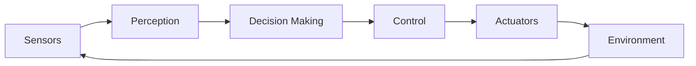
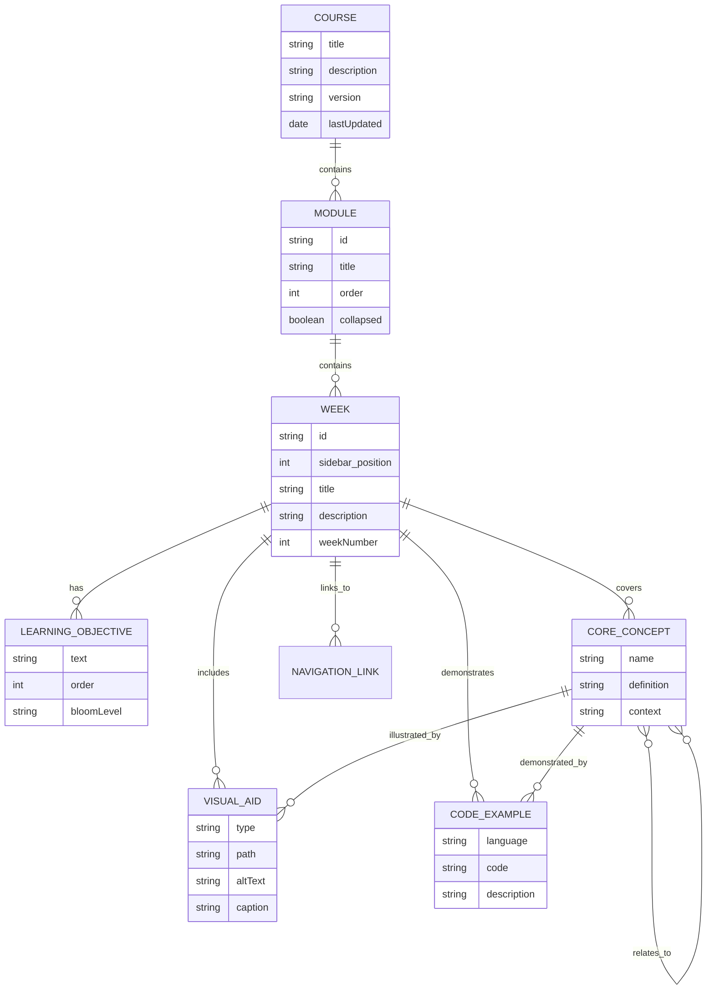

# Data Model: Docusaurus Textbook Site

**Feature**: 001-docusaurus-textbook-site
**Date**: 2025-12-07
**Purpose**: Define content structure, metadata, and relationships for the Physical AI & Humanoid Robotics textbook

## Overview

This data model describes the structure of educational content, navigation, and metadata for a static Docusaurus site. All data is stored as MDX files with YAML frontmatter—no database or external storage is required.

## Entities

### 1. Course

**Description**: Top-level container representing the entire textbook

**Properties**:
| Field | Type | Required | Description | Validation |
|-------|------|----------|-------------|------------|
| `title` | string | Yes | Course title | Max 100 chars |
| `description` | string | Yes | Course description | Max 500 chars |
| `version` | string | Yes | Content version (semver) | Matches `\d+\.\d+\.\d+` |
| `lastUpdated` | date | Yes | Last content update date | ISO 8601 format |
| `author` | string | Yes | Primary author/institution | Max 100 chars |
| `license` | string | Yes | Content license | Valid SPDX identifier |
| `repository` | URL | Yes | GitHub repository URL | Valid HTTPS URL |

**Source**: `docusaurus.config.js` site metadata

**Example**:
```javascript
{
  title: 'Physical AI & Humanoid Robotics Textbook',
  description: 'A comprehensive 13-week course covering Physical AI, ROS 2, robot simulation, NVIDIA Isaac, and VLA systems',
  version: '1.0.0',
  lastUpdated: '2025-12-07',
  author: 'Panaversity',
  license: 'CC-BY-4.0',
  repository: 'https://github.com/your-org/ai-native-text-book'
}
```

### 2. Module

**Description**: Major thematic section grouping related weeks (4 modules total)

**Properties**:
| Field | Type | Required | Description | Validation |
|-------|------|----------|-------------|------------|
| `id` | string | Yes | Unique module identifier | `module-{1-4}` |
| `title` | string | Yes | Module display title | Max 100 chars |
| `description` | string | Yes | Module overview | Max 300 chars |
| `order` | integer | Yes | Display order in sidebar | 1-4 |
| `collapsed` | boolean | Yes | Default collapse state | true/false |
| `weekIds` | string[] | Yes | Week IDs in this module | Min 1, max 10 |

**Relationships**:
- Contains multiple `Week` entities
- Belongs to one `Course`

**Source**: `sidebars.js` category configuration

**Example**:
```javascript
{
  id: 'module-1',
  title: 'Module 1: Introduction to Physical AI & ROS 2',
  description: 'Foundations of embodied intelligence and ROS 2 fundamentals',
  order: 1,
  collapsed: false,
  weekIds: ['week-1', 'week-2', 'week-3', 'week-4', 'week-5']
}
```

**State Transitions**: None (static configuration)

### 3. Week

**Description**: Single week of course content (13 weeks total)

**Properties (Frontmatter)**:
| Field | Type | Required | Description | Validation |
|-------|------|----------|-------------|------------|
| `id` | string | Yes | Unique week identifier | `week-{1-13}` |
| `sidebar_position` | integer | Yes | Order within module | 1-13 |
| `title` | string | Yes | Week title | Max 100 chars |
| `description` | string | Yes | Week summary | Max 200 chars |
| `moduleId` | string | Yes | Parent module ID | Valid module ID |
| `weekNumber` | integer | Yes | Sequential week number | 1-13 |
| `estimatedHours` | integer | No | Estimated study time | 1-20 hours |
| `tags` | string[] | No | Topic tags for search | Max 10 tags |
| `lastReviewed` | date | No | Last content review date | ISO 8601 format |

**Content Structure** (in MDX body):
- **Learning Objectives**: List of 3-5 learning goals
- **Core Concepts**: 2-4 major concepts with definitions
- **Practical Explanation**: Detailed explanation with examples
- **Visual Aids**: Diagrams, images, code examples
- **Summary**: Key takeaways and next steps

**Relationships**:
- Belongs to one `Module`
- Contains multiple `LearningObjective`, `CoreConcept`, `VisualAid`, `CodeExample` entities
- References previous/next `Week` for navigation

**Source**: `docs/module-{X}/week-{Y}/index.md`

**Example Frontmatter**:
```yaml
---
id: week-1
sidebar_position: 1
title: "Week 1: Physical AI Foundations"
description: "Introduction to embodied intelligence, sensor-actuator loops, and real-world applications"
moduleId: module-1
weekNumber: 1
estimatedHours: 8
tags: [physical-ai, embodied-intelligence, foundations]
lastReviewed: 2025-12-07
---
```

**State Transitions**: None (static content)

### 4. LearningObjective

**Description**: Specific learning goal for a week

**Properties**:
| Field | Type | Required | Description | Validation |
|-------|------|----------|-------------|------------|
| `text` | string | Yes | Objective statement | Starts with action verb, max 200 chars |
| `weekId` | string | Yes | Parent week ID | Valid week ID |
| `order` | integer | Yes | Display order | 1-10 |
| `bloomLevel` | string | No | Bloom's taxonomy level | remember/understand/apply/analyze/evaluate/create |

**Relationships**:
- Belongs to one `Week`

**Source**: Embedded in week MDX within `<LearningObjectives>` component

**Example**:
```markdown
<LearningObjectives>
- Explain the concept of embodied intelligence and its applications in robotics
- Identify key components of sensor-actuator control loops
- Analyze real-world examples of Physical AI systems
</LearningObjectives>
```

**Validation Rules**:
- Must start with action verb (explain, identify, analyze, design, implement)
- Each week must have 3-5 objectives
- Objectives should be measurable and specific

### 5. CoreConcept

**Description**: Key technical concept covered in a week

**Properties**:
| Field | Type | Required | Description | Validation |
|-------|------|----------|-------------|------------|
| `name` | string | Yes | Concept name | Max 100 chars |
| `definition` | string | Yes | Concept definition | Max 500 chars |
| `context` | string | Yes | Why it matters | Max 300 chars |
| `weekId` | string | Yes | Parent week ID | Valid week ID |
| `order` | integer | Yes | Display order | 1-10 |
| `relatedConcepts` | string[] | No | Related concept names | Max 5 |

**Relationships**:
- Belongs to one `Week`
- May reference other `CoreConcept` entities via `relatedConcepts`
- May have associated `VisualAid` or `CodeExample`

**Source**: Embedded in week MDX as H3 sections under "Core Concepts"

**Example**:
```markdown
### Embodied Intelligence

**Definition**: The ability of a physical agent to interact with and learn from its environment through sensors and actuators.

**Context**: Unlike traditional AI that operates in digital environments, embodied intelligence requires dealing with real-world physics, noise, and uncertainty. This concept is fundamental to understanding Physical AI systems.

**Related Concepts**: Sensor-actuator loops, closed-loop control, sim-to-real transfer
```

### 6. VisualAid

**Description**: Diagram, chart, or image supporting concept explanation

**Properties**:
| Field | Type | Required | Description | Validation |
|-------|------|----------|-------------|------------|
| `type` | string | Yes | Visual type | image/mermaid/svg/chart |
| `path` | string | Conditional | File path (if image/svg) | Valid path in `/static/img/` |
| `mermaidCode` | string | Conditional | Mermaid syntax (if mermaid) | Valid Mermaid syntax |
| `altText` | string | Yes | Accessibility description | Max 200 chars |
| `caption` | string | Yes | Display caption | Max 150 chars |
| `weekId` | string | Yes | Parent week ID | Valid week ID |
| `width` | integer | No | Display width (px) | 200-1200 |

**Relationships**:
- Belongs to one `Week`
- May illustrate one or more `CoreConcept` entities

**Source**: Embedded in week MDX as images or Mermaid blocks

**Example (Image)**:
```markdown

```

**Example (Mermaid)**:
```markdown

```

**Validation Rules**:
- All images must have descriptive alt text
- Image files must be optimized (WebP preferred, <200KB per image)
- Captions must describe what the visual shows, not just repeat alt text

### 7. CodeExample

**Description**: Syntax-highlighted code snippet demonstrating a concept

**Properties**:
| Field | Type | Required | Description | Validation |
|-------|------|----------|-------------|------------|
| `language` | string | Yes | Programming language | python/cpp/yaml/xml/bash/javascript |
| `code` | string | Yes | Source code | Valid syntax for language |
| `description` | string | Yes | What the code does | Max 200 chars |
| `weekId` | string | Yes | Parent week ID | Valid week ID |
| `filename` | string | No | Original filename | Max 100 chars |
| `highlightLines` | integer[] | No | Lines to highlight | Valid line numbers |

**Relationships**:
- Belongs to one `Week`
- Demonstrates one or more `CoreConcept` entities

**Source**: Embedded in week MDX as fenced code blocks

**Example**:
```markdown
```python title="simple_publisher.py" {5-7}
import rclpy
from rclpy.node import Node
from std_msgs.msg import String

class SimplePublisher(Node):
    def __init__(self):
        super().__init__('simple_publisher')
        self.publisher = self.create_publisher(String, 'topic', 10)

    def publish_message(self, msg):
        self.publisher.publish(String(data=msg))
```

This example demonstrates creating a ROS 2 publisher node that publishes String messages.
```

**Validation Rules**:
- Must specify language for syntax highlighting
- Code must be syntactically valid (linted before publishing)
- Complex examples (>30 lines) should link to full file in GitHub repo
- All code examples must include description/context

### 8. NavigationLink

**Description**: Previous/next navigation between weeks

**Properties**:
| Field | Type | Required | Description | Validation |
|-------|------|----------|-------------|------------|
| `fromWeekId` | string | Yes | Source week | Valid week ID |
| `toWeekId` | string | Yes | Target week | Valid week ID |
| `direction` | string | Yes | Navigation direction | previous/next |
| `label` | string | Yes | Link text | Max 100 chars |

**Relationships**:
- Connects two `Week` entities

**Source**: Auto-generated by Docusaurus based on sidebar order; can override in frontmatter

**Example**:
```yaml
---
pagination_prev: module-1-physical-ai/week-1/index
pagination_next: module-1-physical-ai/week-3/index
---
```

## Entity Relationships Diagram



## Content Organization

### Module Distribution

| Module | ID | Weeks | Topics |
|--------|-----|-------|--------|
| Module 1 | `module-1-physical-ai` | 1-5 | Physical AI foundations, ROS 2 basics |
| Module 2 | `module-2-simulation` | 6-7 | Gazebo, Unity robotics |
| Module 3 | `module-3-isaac` | 8-10 | Isaac SDK, Isaac Sim, RL |
| Module 4 | `module-4-humanoid-vla` | 11-13 | Humanoid robotics, VLA systems |

### Week-to-Module Mapping

```javascript
const weekMapping = {
  'week-1': { module: 'module-1-physical-ai', title: 'Physical AI Foundations' },
  'week-2': { module: 'module-1-physical-ai', title: 'Embodied Intelligence' },
  'week-3': { module: 'module-1-physical-ai', title: 'ROS 2 Basics' },
  'week-4': { module: 'module-1-physical-ai', title: 'ROS 2 Communication' },
  'week-5': { module: 'module-1-physical-ai', title: 'ROS 2 Packages' },
  'week-6': { module: 'module-2-simulation', title: 'Gazebo Simulation' },
  'week-7': { module: 'module-2-simulation', title: 'Unity Robotics' },
  'week-8': { module: 'module-3-isaac', title: 'Isaac SDK' },
  'week-9': { module: 'module-3-isaac', title: 'Isaac Sim & Perception' },
  'week-10': { module: 'module-3-isaac', title: 'RL & Sim-to-Real' },
  'week-11': { module: 'module-4-humanoid-vla', title: 'Humanoid Kinematics' },
  'week-12': { module: 'module-4-humanoid-vla', title: 'Bipedal Locomotion' },
  'week-13': { module: 'module-4-humanoid-vla', title: 'VLA Systems' }
};
```

## Validation Rules

### Content Validation

All week content must pass these checks before publishing:

1. **Frontmatter Validation**:
   - All required fields present
   - `weekNumber` matches directory structure
   - `sidebar_position` is unique within module
   - Tags are lowercase and hyphenated

2. **Structure Validation**:
   - Contains all 5 required sections (Learning Objectives, Core Concepts, Practical Explanation, Visual Aids, Summary)
   - Learning Objectives: 3-5 items
   - Core Concepts: 2-4 subsections
   - Summary: Present and non-empty

3. **Accessibility Validation**:
   - All images have alt text
   - Heading hierarchy is correct (h1 → h2 → h3, no skipping)
   - Code blocks have language identifiers

4. **Link Validation**:
   - All internal links resolve correctly
   - External links are HTTPS and accessible
   - No broken anchors

5. **Performance Validation**:
   - Page size < 500KB
   - Images optimized (WebP or compressed JPEG/PNG)
   - No inline base64 images > 10KB

## Migration and Versioning

### Content Versioning Strategy

- **Version Format**: `MAJOR.MINOR.PATCH`
  - **MAJOR**: Curriculum restructuring (module changes, week reordering)
  - **MINOR**: New weeks or major content additions
  - **PATCH**: Content updates, fixes, clarifications

- **Metadata**: Each week includes `lastReviewed` date
- **Changelog**: Maintained in `/docs/changelog.md`

### Backward Compatibility

- URL structure remains stable (no breaking path changes)
- Frontmatter fields can be added but not removed
- Deprecated content marked with admonitions

## Summary

This data model defines 8 core entities for the Docusaurus textbook:

1. **Course**: Top-level metadata
2. **Module**: Thematic grouping (4 total)
3. **Week**: Individual chapters (13 total)
4. **LearningObjective**: Learning goals (3-5 per week)
5. **CoreConcept**: Key concepts (2-4 per week)
6. **VisualAid**: Diagrams and images
7. **CodeExample**: Code snippets
8. **NavigationLink**: Prev/next navigation

All data is stored in MDX files with YAML frontmatter, ensuring version control, simplicity, and static site compatibility. Validation rules enforce consistency, accessibility, and quality standards aligned with the project constitution.
