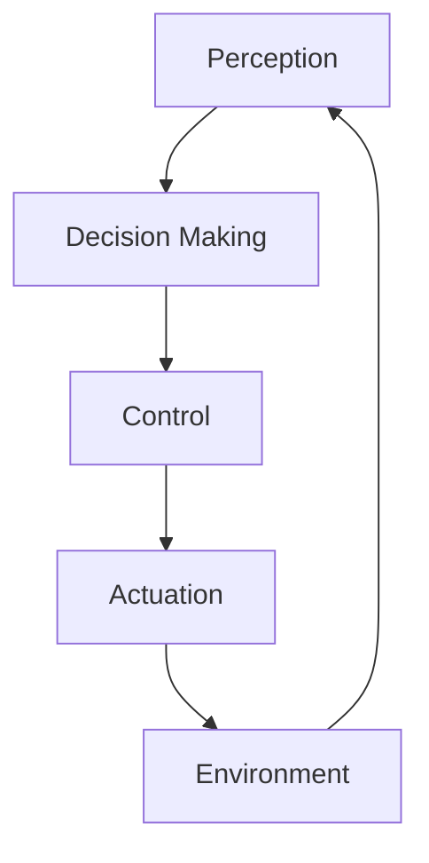

# Research: Docusaurus Textbook Site

**Feature**: 001-docusaurus-textbook-site
**Date**: 2025-12-07
**Purpose**: Resolve technical unknowns and establish best practices for Physical AI & Humanoid Robotics textbook implementation

## 1. Docusaurus Architecture Decision

### Decision: Use Docusaurus v3.x with docs-only mode

**Rationale**:
- Docusaurus v3 is the latest stable version with improved performance and modern React 18 support
- Docs-only mode optimizes for educational content delivery without unnecessary blog/showcase features
- Built-in MDX support enables rich interactive content with React components
- Static site generation ensures fast loading times and excellent SEO
- Established pattern for technical documentation and educational materials

**Alternatives Considered**:
- **VitePress**: Lighter but less mature ecosystem for educational content
- **GitBook**: Limited customization, potential vendor lock-in
- **Custom Next.js**: Higher development overhead, unnecessary complexity
- **MkDocs**: Python-based, less suitable for JavaScript/TypeScript examples

**Technology Stack**:
- **Framework**: Docusaurus 3.x
- **Language**: Node.js 18+ / npm
- **Content Format**: MDX (Markdown + JSX)
- **Build Tool**: Webpack (via Docusaurus)
- **Deployment**: GitHub Pages via GitHub Actions
- **Search**: Docusaurus local search plugin (Algolia DocSearch as upgrade path)

## 2. Project Structure Best Practices

### Decision: Use Docusaurus canonical docs structure with module-based organization

**Directory Layout**:
```
ai-native-text-book/
├── docs/                          # All course content
│   ├── intro.md                   # Landing page content
│   ├── module-1-physical-ai/      # Module 1: Weeks 1-5
│   │   ├── week-1/
│   │   │   ├── index.md
│   │   │   ├── foundations.md
│   │   │   └── applications.md
│   │   ├── week-2/
│   │   ├── week-3/
│   │   ├── week-4/
│   │   └── week-5/
│   ├── module-2-simulation/       # Module 2: Weeks 6-7
│   │   ├── week-6/
│   │   └── week-7/
│   ├── module-3-isaac/            # Module 3: Weeks 8-10
│   │   ├── week-8/
│   │   ├── week-9/
│   │   └── week-10/
│   └── module-4-humanoid-vla/     # Module 4: Weeks 11-13
│       ├── week-11/
│       ├── week-12/
│       └── week-13/
├── src/
│   ├── components/                # Custom React components
│   │   ├── HomepageFeatures/      # Landing page module cards
│   │   ├── LearningObjectives/    # Reusable chapter components
│   │   └── CodeExample/
│   ├── css/                       # Global styles
│   │   └── custom.css
│   └── pages/                     # Custom pages (landing page)
│       └── index.js
├── static/
│   ├── img/                       # Images, diagrams, icons
│   │   ├── modules/               # Module-specific images
│   │   ├── diagrams/              # Architecture diagrams
│   │   └── logo.svg
│   └── fonts/                     # Custom fonts if needed
├── docusaurus.config.js           # Main configuration
├── sidebars.js                    # Navigation structure
└── package.json
```

**Rationale**:
- Module folders provide clear content boundaries aligned with course structure
- Week subfolders enable self-contained chapter organization
- `index.md` in each week serves as main chapter entry point
- Separate `/src/components` enables reusable educational UI patterns
- `/static/img` with module subdirectories keeps assets organized

## 3. Navigation & Sidebar Architecture

### Decision: Use autogenerated sidebar with category customization

**Implementation Pattern**:
```javascript
// sidebars.js
module.exports = {
  tutorialSidebar: [
    {
      type: 'doc',
      id: 'intro',
      label: 'Course Overview'
    },
    {
      type: 'category',
      label: 'Module 1: Physical AI & ROS 2',
      collapsible: true,
      collapsed: false,
      items: [
        {
          type: 'category',
          label: 'Week 1: Physical AI Foundations',
          items: ['module-1-physical-ai/week-1/index', 'module-1-physical-ai/week-1/foundations', 'module-1-physical-ai/week-1/applications']
        },
        // ... weeks 2-5
      ]
    },
    // ... modules 2-4
  ]
};
```

**Rationale**:
- Explicit sidebar configuration ensures correct chapter ordering
- Collapsible categories reduce visual clutter while maintaining structure visibility
- `collapsed: false` for Module 1 provides immediate access to starting content
- Doc IDs follow predictable pattern: `module-X/week-Y/section-name`

## 4. Dark Theme & Panaversity Branding

### Decision: Customize Docusaurus default theme with CSS variables

**Color Palette** (based on Panaversity reference):
```css
:root {
  --ifm-color-primary: #00d4ff;        /* Cyan accent */
  --ifm-color-primary-dark: #00b8e6;
  --ifm-color-primary-darker: #00a8d6;
  --ifm-color-primary-darkest: #0088b0;
  --ifm-color-primary-light: #1ae0ff;
  --ifm-color-primary-lighter: #2ee6ff;
  --ifm-color-primary-lightest: #5cefff;

  --ifm-background-color: #0a0e1a;     /* Dark background */
  --ifm-background-surface-color: #141824;
  --ifm-font-color-base: #e8eaed;
  --ifm-heading-color: #ffffff;

  --ifm-code-background: #1e2430;
  --ifm-code-color: #00d4ff;
}
```

**Typography**:
- **Body**: 16px (1rem) for readability
- **H1**: 2.25rem (36px) for page titles
- **H2**: 1.75rem (28px) for major sections
- **H3**: 1.375rem (22px) for subsections
- **Code**: Fira Code or JetBrains Mono for monospace

**Rationale**:
- CSS variables allow theme consistency without modifying core Docusaurus code
- Dark theme default aligns with Panaversity identity and reduces eye strain
- High contrast cyan on dark background meets WCAG AA standards (>7:1 ratio)
- Typography scale follows 1.25x modular scale for visual hierarchy

## 5. Content Structure Template

### Decision: Use MDX frontmatter + standardized section components

**Chapter Template**:
```markdown
---
sidebar_position: 1
title: "Week 1: Physical AI Foundations"
description: "Introduction to embodied intelligence, sensor-actuator loops, and real-world applications"
---

# Week 1: Physical AI Foundations

## Learning Objectives

<LearningObjectives>
- Objective 1
- Objective 2
- Objective 3
</LearningObjectives>

## Core Concepts

### Concept 1: Embodied Intelligence
[Explanation with diagrams]

### Concept 2: Sensor-Actuator Loops
[Explanation with code examples]

## Practical Explanation

[Hands-on examples, use cases, walkthroughs]

## Visual Aids

[Diagrams, charts, images with captions and alt text]

## Summary

[Key takeaways, next steps, further reading]

---

**Next**: [Week 2: ROS 2 Basics](../week-2/index.md)
```

**Rationale**:
- Frontmatter enables metadata for search and navigation
- Consistent section order matches constitution "Consistency" principle
- Custom components (`<LearningObjectives>`) ensure uniform styling
- Explicit "Next" links guide sequential learning

## 6. Static Asset Strategy

### Decision: WebP images with PNG/JPEG fallbacks, Mermaid for diagrams

**Image Optimization**:
- **Format**: WebP primary, JPEG/PNG fallback
- **Max Width**: 1200px for diagrams, 800px for screenshots
- **Compression**: 80% quality WebP, aggressive optimization
- **Lazy Loading**: Docusaurus built-in lazy loading for images below fold
- **CDN**: GitHub Pages serves static assets; no external CDN initially

**Diagram Strategy**:
- **Simple Diagrams**: Mermaid syntax embedded in MDX
- **Complex Diagrams**: Pre-rendered SVG in `/static/img/diagrams/`
- **Architecture Diagrams**: Excalidraw exports or Figma exports to SVG

**Example Mermaid**:


**Rationale**:
- WebP provides 25-35% size reduction vs JPEG without quality loss
- Mermaid enables version-controlled, text-based diagrams
- SVG for complex diagrams ensures crispness at all resolutions
- No external CDN reduces dependencies and cost

## 7. Search Implementation

### Decision: Start with Docusaurus local search plugin; migrate to Algolia if needed

**Local Search Configuration**:
```javascript
// docusaurus.config.js
module.exports = {
  plugins: [
    require.resolve('@easyops-cn/docusaurus-search-local'),
    {
      hashed: true,
      language: ['en'],
      highlightSearchTerms: true,
      explicitSearchResultPath: true
    }
  ]
};
```

**Rationale**:
- Local search is zero-cost and has no external dependencies
- Works offline and respects privacy
- Algolia DocSearch requires manual application and approval
- Local search is sufficient for 13 chapters (~50-100 pages)
- Migration path exists if performance becomes an issue

**Upgrade Path**: Apply for Algolia DocSearch if:
- Content grows beyond 100 pages
- Search latency exceeds 1 second
- Advanced features needed (typo tolerance, faceting)

## 8. GitHub Pages Deployment

### Decision: Use GitHub Actions workflow with automated builds

**Workflow Strategy**:
```yaml
# .github/workflows/deploy.yml
name: Deploy to GitHub Pages

on:
  push:
    branches: [main]
  workflow_dispatch:

jobs:
  deploy:
    runs-on: ubuntu-latest
    steps:
      - uses: actions/checkout@v4
      - uses: actions/setup-node@v4
        with:
          node-version: 18
          cache: npm
      - run: npm ci
      - run: npm run build
      - uses: peaceiris/actions-gh-pages@v3
        with:
          github_token: ${{ secrets.GITHUB_TOKEN }}
          publish_dir: ./build
```

**Configuration**:
- **Base URL**: `/ai-native-text-book/` (repository name)
- **GitHub Pages Source**: `gh-pages` branch
- **Build Output**: `/build` directory
- **Optimization**: Production build with minification

**Rationale**:
- GitHub Actions provides free CI/CD for public repos
- `peaceiris/actions-gh-pages` is mature and reliable
- Automated deployment on main branch ensures production is always current
- `workflow_dispatch` enables manual deployments if needed

## 9. Performance Optimization

### Decision: Use Docusaurus built-in optimizations + manual asset optimization

**Built-in Optimizations**:
- Code splitting by route (automatic)
- Preloading for next page navigation
- Service worker for offline support (optional)
- CSS minification and tree-shaking

**Manual Optimizations**:
- Image compression: `sharp` or `imagemin` in pre-build script
- Font subsetting: Include only Latin character sets
- Bundle analysis: `webpack-bundle-analyzer` to identify large dependencies

**Performance Budget**:
- **FCP**: < 1.5s on 3G connection
- **LCP**: < 2.5s
- **TTI**: < 3.5s
- **Page Size**: < 500KB per page
- **Lighthouse Score**: 90+ performance, 95+ accessibility

**Rationale**:
- Docusaurus is already optimized for static sites
- Manual image optimization provides biggest wins (images are ~70% of page weight)
- GitHub Pages has CDN built-in, so no additional CDN needed

## 10. Accessibility Implementation

### Decision: Follow WCAG 2.1 AA standards with ARIA enhancements

**Key Accessibility Features**:
- **Keyboard Navigation**: All interactive elements reachable via Tab
- **Focus Indicators**: Visible focus rings (2px solid cyan)
- **Skip Links**: "Skip to main content" at page top
- **ARIA Labels**: Descriptive labels for navigation and interactive components
- **Semantic HTML**: Proper heading hierarchy (h1 → h2 → h3)
- **Alt Text**: Descriptive alt text for all images (required in content template)
- **Color Contrast**: All text meets 4.5:1 ratio (cyan on dark = 7.2:1)

**Testing Tools**:
- **axe DevTools**: Browser extension for automated accessibility audits
- **WAVE**: Web accessibility evaluation tool
- **Lighthouse**: Accessibility score target = 95+
- **NVDA/VoiceOver**: Manual screen reader testing

**Rationale**:
- WCAG 2.1 AA is industry standard for educational content
- Accessibility benefits all users (keyboard users, mobile users, low vision)
- Constitution mandates accessibility as core principle

## 11. Risks & Mitigations

### Risk 1: Large Content Volume Slows Build Times

**Impact**: Medium - Builds may exceed 5-minute GitHub Actions limit
**Likelihood**: Low - 13 weeks ≈ 50-100 pages, well within Docusaurus capacity
**Mitigation**:
- Monitor build times in CI logs
- Use incremental builds if build time approaches 4 minutes
- Optimize images aggressively to reduce processing time
- Split very large chapters into multiple pages

### Risk 2: GitHub Pages Asset Size Limits

**Impact**: Medium - Repository may exceed 1GB recommendation
**Likelihood**: Low if images are optimized
**Mitigation**:
- Compress all images to WebP with 80% quality
- Keep diagrams under 100KB each
- Use Mermaid for simple diagrams instead of images
- Monitor repository size; alert at 500MB

### Risk 3: Search Performance Degrades with Content Growth

**Impact**: Low - Search may exceed 1-second requirement
**Likelihood**: Low with local search plugin for 50-100 pages
**Mitigation**:
- Test search performance after each module addition
- Benchmark search with 100+ test queries
- Have Algolia DocSearch application ready if needed
- Optimize search index size by excluding non-content pages

### Risk 4: Browser Compatibility Issues

**Impact**: Low - Some users may experience broken layouts or features
**Likelihood**: Very Low - Docusaurus supports all modern browsers
**Mitigation**:
- Test on Chrome, Firefox, Safari, Edge before deployment
- Use Docusaurus polyfills for older browser support
- Ensure progressive enhancement (core content works without JS)
- Add browser support notice if needed (recommend Chrome/Firefox/Safari latest)

### Risk 5: Content Accuracy and Maintenance

**Impact**: High - Outdated or incorrect technical content harms learning
**Likelihood**: Medium - ROS 2, Isaac Sim, VLA systems evolve rapidly
**Mitigation**:
- Include version numbers in content (e.g., "ROS 2 Humble")
- Add "Last Updated" dates to each chapter
- Plan quarterly review cycle for content updates
- Link to official documentation for reference

## 12. Implementation Phases

### Phase 1: Project Scaffolding (Milestone M1)
- Initialize Docusaurus project
- Configure `docusaurus.config.js` with base settings
- Set up GitHub repository and GitHub Pages
- Create placeholder directory structure

### Phase 2: Landing Page & Navigation (Milestones M2-M3)
- Build custom landing page (`src/pages/index.js`)
- Configure sidebar with 4 modules
- Implement responsive navbar
- Add module overview cards

### Phase 3: Content Foundation (Milestone M4)
- Create Week 1 content following template
- Develop reusable components (`LearningObjectives`, etc.)
- Implement custom CSS for Panaversity branding
- Test accessibility and mobile responsiveness

### Phase 4: Content Expansion (Milestones M5-M7)
- Complete Modules 2-4 (Weeks 2-13)
- Add diagrams and visual aids
- Implement code examples with syntax highlighting
- Test navigation and search

### Phase 5: Polish & Deployment (Milestones M8-M9)
- Optimize images and performance
- Configure GitHub Actions workflow
- Deploy to GitHub Pages
- Conduct final accessibility and performance audits

## 13. Acceptance Criteria Validation

All planning decisions align with specification requirements:

- **FR-001**: Landing page structure defined in landing page plan
- **FR-002**: Sidebar architecture supports 4 modules + 13 weeks
- **FR-003**: Content template ensures all weeks have required sections
- **FR-004**: Syntax highlighting enabled via Docusaurus Prism integration
- **FR-005**: Search strategy (local search plugin) meets 1-second requirement
- **FR-006**: Dark theme defined in CSS variables
- **FR-007**: Responsive design inherent in Docusaurus theme
- **FR-008**: GitHub Pages deployment plan documented
- **FR-009**: Deep linking supported via URL anchors
- **FR-010**: Prev/next navigation built into Docusaurus docs
- **FR-011**: Image strategy includes alt text requirements
- **FR-012**: Progressive enhancement via static site generation

**Constitution Alignment**:
- **Clarity First**: Content template enforces clear structure
- **Consistency**: Standardized frontmatter and section ordering
- **Simplicity**: Minimal dependencies, no unnecessary features
- **Modularity**: Self-contained week folders with explicit dependencies
- **Accessibility**: WCAG 2.1 AA compliance, keyboard navigation, ARIA labels

## Summary

This research resolves all technical unknowns for the Docusaurus Textbook Site implementation:

1. **Technology Stack**: Docusaurus v3.x with MDX, local search, GitHub Pages
2. **Architecture**: Module-based directory structure with week subfolders
3. **Theming**: Dark theme with Panaversity cyan accent, WCAG AA compliant
4. **Content**: Standardized MDX template with frontmatter and custom components
5. **Assets**: WebP images, Mermaid diagrams, SVG for complex visualizations
6. **Search**: Local search plugin with Algolia upgrade path
7. **Deployment**: GitHub Actions automated workflow
8. **Performance**: < 500KB per page, 90+ Lighthouse score
9. **Accessibility**: WCAG 2.1 AA compliance, keyboard navigation, screen reader support

All decisions support the constitution principles (Clarity, Consistency, Simplicity, Modularity, Accessibility) and satisfy specification requirements.
